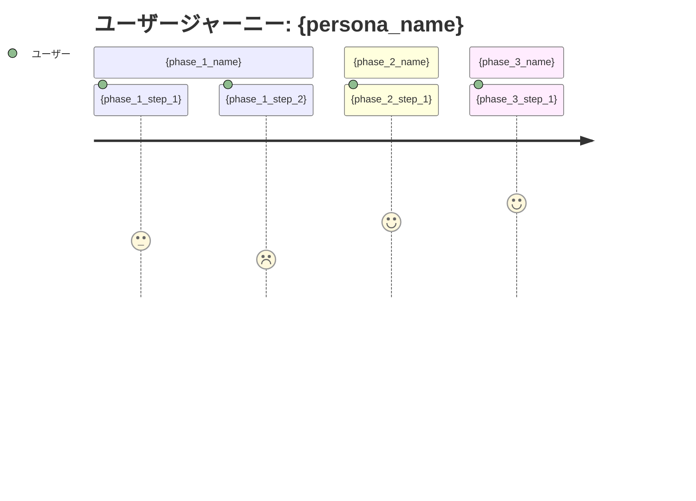

# 要求定義書: {project_name}

> Vモデル: 要求分析 / 対応する検証: 受入テスト
> このプロジェクトで「誰の・どんな課題を・なぜ解決するか」を定義する。

## 1. 背景・課題

### 背景

{background}

### 現状

{current_situation}

### 課題一覧

| # | 課題 | 影響度 | 優先度 |
|---|------|--------|--------|
| 1 | {issue_1} | 高/中/低 | 高/中/低 |
| 2 | {issue_2} | 高/中/低 | 高/中/低 |
| 3 | {issue_3} | 高/中/低 | 高/中/低 |

## 2. ゴール

### ビジネスゴール

{business_goal}

### ユーザーゴール

{user_goal}

### 成功指標（KPI）

| 指標 | 目標値 | 測定方法 |
|------|--------|---------|
| {kpi_1} | {target_1} | {method_1} |
| {kpi_2} | {target_2} | {method_2} |

## 3. ペルソナ

### {persona_name}

| 項目 | 内容 |
|------|------|
| 名前 | {name} |
| 年齢 | {age}代 |
| 職業 | {job_title} |
| 部門 | {department} |
| 技術スキル | {tech_skill_level} |

**目標・ゴール**

- {goal_1}
- {goal_2}

**課題（ペインポイント）**

- {pain_point_1}
- {pain_point_2}

**利用状況**

| 利用場面 | 頻度 | 詳細 |
|---------|------|------|
| {scenario_1} | {frequency_1} | {detail_1} |
| {scenario_2} | {frequency_2} | {detail_2} |

## 4. ユーザージャーニー

### メインフロー

| # | フェーズ | 行動 | 課題・感情 | 解決 |
|---|---------|------|----------|------|
| 1 | {phase_1_name} | {action_1} | {issue_1} | {solution_1} |
| 2 | {phase_2_name} | {action_2} | {issue_2} | {solution_2} |
| 3 | {phase_3_name} | {action_3} | {issue_3} | {solution_3} |

### 感情の変化

- **開始時**: {emotion_start}
- **最初のつまずき**: {emotion_first_friction}
- **ブレークスルー**: {emotion_breakthrough}
- **ゴール達成時**: {emotion_goal}

## 5. 利害関係者

| 利害関係者 | 期待 |
|-----------|------|
| {stakeholder_1} | {expectation_1} |
| {stakeholder_2} | {expectation_2} |

---

## 次のステップ

→ `02-requirement`（要件定義書）で機能一覧・要件・スコープ・非機能要件を定義する
