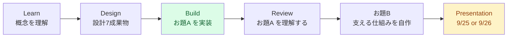
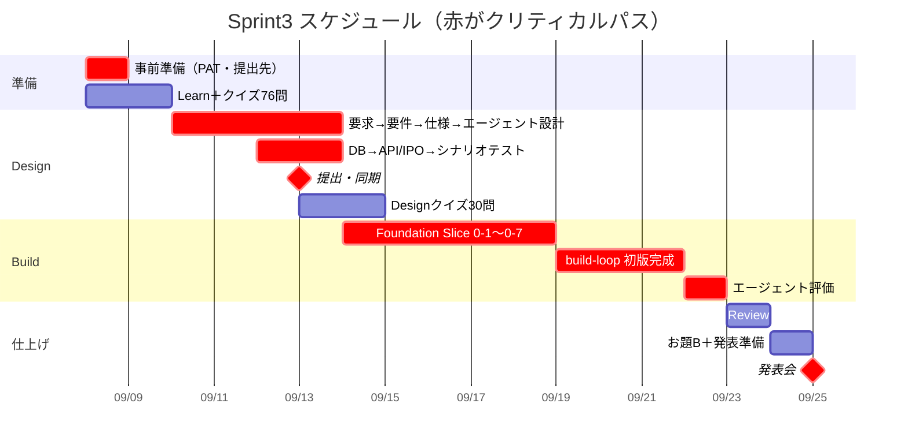
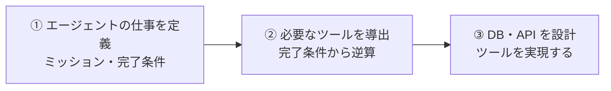

# Sprint3 プロジェクト計画書

> 作成 2026-09-08 / 対象: 柳川純二（開発トラック・個人開発）
> 根拠: ブートキャンプアプリの教材28本（`~/r2b/r2b-docs/`）＋ Slack 運営告知（2026-09-06）

---

## 1. 結論：この Sprint で何をいつまでにやるか

**絶対の締切は1つだけ。9/25（金）または 9/26（土）18:00〜20:00 の発表会。** 今日（9/8）から数えて 17〜18日。

その1点に向けて、**お題A（引合書整理エージェント）を作りきり、お題B（支える仕組みの自作）に触れ、両方を自分の言葉で説明できる状態**にする。

作業量の山は Build。**9/19（土）〜9/23（水）の5連休**が唯一まとまった時間なので、ここに Build 完成と Review を置く。逆算すると、**連休前の平日夜で Design と Foundation を終わらせておく必要がある。**

---

## 2. Sprint3 の全体像

| 項目 | 内容 |
|------|------|
| テーマ | AI Agent を設計・開発し、**その開発環境そのものも理解する** |
| 体制 | **個人開発**（Sprint2 のチーム開発から変更） |
| スタック | Claude Agent SDK（Python）＋ FastAPI ＋ PostgreSQL(Docker) ＋ Next.js 15 |
| 実行環境 | **すべてローカル。AWS デプロイなし**（インフラは Sprint2 で経験済み） |
| リポジトリ | `Yana87git/r2b-sprint3`（private）／ローカル `~/r2b/r2b-sprint3` |
| 発表 | 1人20分（発表13〜14分・質疑6〜7分）。スライドは任意 |

### お題は2本立て



- **お題A** — 商社の引合書（Excel・PDF・メール）を読み取り、構造化 JSON にして品目リスト Excel を生成するエージェント。重要な確定操作の前に Human-in-the-Loop を挟む
- **お題B** — Review 後に着手。`/r2b-env-sprint3`（開発環境の自作）か `/r2b-present-sprint3`（スライド生成エンジンの自作）の**どちらか一方**
  - **開発トラックなので ① `/r2b-env-sprint3` を推奨**（教材が明示）。Skill・サブエージェント・Rule・Hooks・権限から2〜3件を自作する
  - このフェーズに**提出物はない**。発表会で共有する

### アプリ上の進捗カウンタ（2026-09-08 時点）

Sprint3 画面のタブがそのまま進捗の定義になっている。**合計 136問のクイズと2件の提出物**がある。

| タブ | 現在 | 中身 |
|------|------|------|
| 1. Learn | 0/8 | 教材8本の**読了チェック**（クイズではない） |
| 2. Design | 0/30 | Problem / Product / Architecture の3種 × 10問 |
| 3. Build | 0/30 | 実装したコードを出題ソースとするクイズ |
| 4. Review | 0/1 | 提出物 |
| 5. お題B | — | **提出物なし**（発表会で共有） |
| 6. Presentation | 0/1 | スライド提出（**任意**。作らなければ提出不要） |
| 7. Reviewクイズ | 0/76 | C4 の3階層に対応。**8割が記述式**で Claude が実コードと突き合わせて採点 |

### Sprint2 との違い（3点だけ）

1. インフラ設計（07-infra）が**ない**。代わりに **`agent-plan.md`（エージェント設計）**が設計の背骨になる
2. フロントが React+Vite → **Next.js 15**。CORS のポートが 5173 → **3000**
3. Backend の Python 環境は **uv に統一**（`python -m venv` は使わない。`uv run` を頭に付けるだけ）

---

## 3. 確定スケジュール

| 日付 | 内容 | 出典 |
|------|------|------|
| **9/25（金）18:00〜20:00** | Sprint3 発表会 Day1 | Slack #0300 運営告知 2026-09-06 |
| **9/26（土）18:00〜20:00** | Sprint3 発表会 Day2 | 同上 |
| 9/19（土）〜9/23（水） | **5連休**（敬老の日 9/21・国民の休日 9/22・秋分の日 9/23） | 暦 |

> ⚠️ **自分がどちらの日かは、まだ確定できない（2026-09-08 時点）。**
> 9/6 に運営が配布した時間割PDFは `9月ビジネス Sprint3 発表会_発表割当.pdf`（#0300_9月ビジネスブートキャンプ）で、**ビジネストラック向け**。スレッドで名前を呼ばれているのも全員ビジネストラックの参加者だった。
> **開発トラックの Sprint3 発表会の時間割は、9/8 時点でまだ配布されていない。** #0100_開発サマーブートキャンプ の最新投稿（9/6 15:06）は lab チャンネルの案内のみで、日程には触れていない。#0110_開発チーム10 にも投稿なし。
> → **#0100 / #0110 を待つか、配布時期を運営に確認する。** 9/25 なら本計画どおり、9/26 なら1日の余裕が生まれる。**本計画は厳しい側（9/25）で引いてある。**

---

## 4. マイルストーン（守るべき期日）

**M9 以外はすべて自分で引いた期日。ただし1つ遅れると後段が連鎖して詰む。** 特に M4（Foundation 完了）を連休前に落とせるかが分かれ目。

| # | 期日 | マイルストーン | 完了の判定基準 | 種別 |
|---|------|--------------|--------------|------|
| **M0** | **9/8（火）** | 事前準備の完了 | Fine-grained PAT を登録済み／提出先ブランチ `main` を設定済み | 🔴 必須 |
| **M1** | **9/9（水）** | Learn 完了 | 教材8本の読了チェック（アプリのタブが **8/8**） | 🔴 必須 |
| **M2** | **9/13（日）** | Design 7成果物の提出 | `docs/requirements/` の7ファイルを push → アプリで GitHub同期 → **7項目すべて「提出済み」** | 🔴 必須 |
| **M3** | **9/14（月）** | Design クイズ完了 | Problem / Product / Architecture の3種すべて 10/10 | 🟡 並行可 |
| **M4** | **9/18（金）** | Foundation 完了 | Slice 0-1〜0-7。**0-7 の疎通テストが通り、`backend/traces/` にトレースが出る** | 🔴 必須 |
| **M5** | **9/21（月）** | build-loop 初版完成 | `.claude/memory.md` の全スライスが DONE。エージェントがローカルで動く | 🔴 必須 |
| **M6** | **9/22（火）** | エージェント評価 Pass ＋ Build クイズ | `06-scenario-test.md` の正常系・異常系を実行し、トレースと `agent-plan.md` の完了条件が一致／**Build クイズ 30/30** | 🔴 必須 |
| **M7** | **9/23（水）** | Review 完了 | `/r2b-review-sprint3` のガイドを通し、**Reviewクイズ 76問（8割が記述式）**に回答。`docs/review/review-log.md` に記録 | 🟠 推奨 |
| **M8** | **9/24（木）** | お題B 完了 ＋ 通しリハ | 自作した仕組み2〜3件が動き `docs/env/customizations.md` に記録／13〜14分で通せることを確認 | 🟠 推奨 |
| **M9** | **9/25（金）18:00** | **発表会** | — | 🔴 **絶対** |

### 依存関係とクリティカルパス



**クリティカルパス**: 事前準備 → Design 7成果物 → Foundation 0-7 → build-loop → エージェント評価 → 発表。
**逃がせるもの**: Design クイズ（M3）は Build 開始をブロックしない。Review（M7）とお題B（M8）は提出物がないので、最悪ここを削って発表に間に合わせる。

---

## 5. フェーズ別の進め方

### Phase 0: 事前準備（M0・9/8）

ガイドラインの5項目。**③まで完了済み、④⑤が残っている。**

| # | 項目 | 状態 |
|---|------|------|
| ① | GitHub リポジトリ（Private・README あり） | ✅ `Yana87git/r2b-sprint3` |
| ② | クローンして Claude Code を開く | ✅ 完了 |
| ③ | R2B プラグイン | ✅ `r2b@r2b-marketplace` v3.6.1（最新） |
| ④ | Fine-grained PAT を登録 | ✅ `R2B Sprint3`（Expires 2026-09-30）を 9/8 22:53 に登録 |
| ⑤ | 提出先ブランチを設定 | ✅ `Yana87git/r2b-sprint3` / `main` / 設定済み |

**Phase 0 は 2026-09-08 に完了。** 残作業は旧トークン `R2B Bootcamp`（Fine-grained・Expires 2026-10-07）の削除のみ。

> 旧トークンは Classic ではなく **Fine-grained** だった（当初 Classic と推測していたが誤り）。ガイドラインの「Classic PATを登録済みの方」の移行手順は不要で、単純な差し替えで済んだ。

**④の手順**: GitHub → Settings → Developer settings → Personal access tokens → **Fine-grained tokens** → Generate new token

| 項目 | 設定 |
|------|------|
| Token name | `R2B Sprint3` |
| Expiration | ブートキャンプ終了日（9/26）を含む最短期間 |
| Repository access | **Only select repositories** → `r2b-sprint3` だけ |
| Repository permissions → Contents | **Read-only**（Read and write にしない） |

発行したら [設定 → 外部連携](https://r2b-webapp.vercel.app/settings/integrations) に `Yana87git` と `github_pat_...` を入力 → 接続を更新 → **古い Classic PAT を削除**。

**⑤の手順**: Design 画面上部の「提出先を設定」→ `https://github.com/Yana87git/r2b-sprint3` → `main` → 確定。④を先に済ませないとブランチ候補が出ない。

> ⚠️ PAT は Slack にも提出物にも貼らない。他リポジトリを選ばない。Contents を Read and write にしない。

---

### Phase 1: Learn（M1・9/8〜9/9）

教材は `~/r2b/r2b-docs/learn/` に取得済み（オフラインで読める）。読む順序:

1. `02-Sprint3の全体像.md` — ワークフローとエージェントの違い、4構成要素、お題2本立て
2. `01-Agent基礎.md` — 最長（15,371字）。エージェントの中核
3. `06-補足項目.md`
4. `03-Sprint3の全体像（発展）.md` → `04-自走・企画設計.md` → `05-品質向上とリファクタリング.md` → `08-本番運用品質.md` → `07-補足項目（統合）.md`

**進捗はアプリの「1. Learn」タブが 8/8 になれば完了。** 読了チェックのみで、Learn 単独のクイズはない（`【Sprint2復習】`の4本は進捗対象外）。

**押さえる論点**: エージェントの4構成要素（LLM・ツール・ハーネス・コンテキスト管理）／「お願い」（Skill・サブエージェント・Rule）と「強制」（Hooks・権限）の違い／停止条件とコスト管理。

> ここで理解した内容は Design・Build・Review の全クイズ（30＋30＋76問）の土台になる。飛ばすと後段で効いてくる。

---

### Phase 2: Design（M2・9/10〜9/13）

**入口**: `/r2b-design-sprint3`（進捗表が出て次のスキルへ誘導される）

Vモデル7ステップ＋3レビュー。**「エージェントの仕事を先に決めてから、それを実現する手段を設計する」順番が命。**



| # | スキル | 成果物 | 押さえどころ |
|---|--------|--------|------------|
| 1 | `/design-request` | `01-request.md` | 課題・ゴール・ペルソナ（2〜4人）・ジャーニー・利害関係者。**技術手段はまだ決めない**。会社名は一般化する |
| — | `/design-problem-check` | （指摘レポート） | AI は修正しない。自分で直す |
| 2 | `/design-requirement` | `02-requirement.md` | 機能一覧・受入基準・Scope1〜3・非機能。**受入基準は測定可能に**（シナリオテストと1対1になる） |
| 3 | `/design-spec` | `03-spec.md` ＋ `mocks/mockup.html` | 5〜15画面。アップロード／進捗／HITL確認／ダウンロードを忘れない。**デザイントークンはここで確定し、Build 中に変えられない** |
| 4 | `/design-agent` | **`agent-plan.md`** | ⭐Sprint3 の目玉。Part1（ミッション・インプット・完了条件・体験）／Part2（ツール一覧・サブエージェント・フロー・ガードレール・評価シナリオ） |
| — | `/design-product-check` | （指摘レポート） | 02・03・agent-plan Part1 の整合性 |
| 5 | `/design-db` | `04-db.md` | ツール一覧の「必要なテーブル」から導く。**ジョブ・実行ログ・中間成果物の置き場所を忘れやすい** |
| 6 | `/design-api-ipo` | `05-api-ipo.md` | ツールの「必要なAPI」＋**エージェント自体の起動・進捗取得・結果取得API** |
| — | `/design-implementation-check` | （指摘レポート） | 04・05・agent-plan Part2 の整合性 |
| 7 | `/design-scenario-test` | `06-scenario-test.md` | 受入基準と完了条件に1対1。**異常系（読取不能・最大ターン数超過）を必ず入れる** |

#### ここで一番大事なこと：完了条件

`agent-plan.md` の**完了条件がそのまま評価の合格基準になる**。「いい感じに整理できたら完了」は不可。

> ✅ 「品目リストの全行に品目名・数量・納期が埋まり、Excel が生成されたら完了」
> ❌ 「引合書がうまく整理できたら完了」

**エージェントフローの表は検算として使う。** 呼ぶツールが一覧になければ漏れ。最終行の判定方法が書けなければ完了条件が曖昧。分岐なしで毎回同じ手順に書けてしまうなら、それはエージェントではなく通常のコードで書くべきサイン。

#### 提出（M2）

```bash
git add docs/requirements/
git commit -m "feat: add design documents sprint3"
git push origin main
```

→ アプリの「提出物」タブ →「GitHub同期」→ 7項目が「提出済み」になることを確認。

`docs/requirements/` **直下**に置く（サブディレクトリは同期対象外）。ファイル名は `01-request.md` 等と完全一致させる。`mocks/mockup.html` は提出対象外。

---

### Phase 3: Build（M4〜M6・9/14〜9/22）

**入口**: `/r2b-build-sprint3`（`.claude/` 一式と `backend/` `frontend/` の初期ファイルが配置される）

#### 3-1. Foundation（M4・9/14〜9/18）

`foundation エージェントで Foundation フェーズを開始してください` と伝えて起動。

| Slice | スキル | 作るもの |
|-------|--------|---------|
| 0-1 | `/foundation-backend-setup` | FastAPI の骨格 |
| 0-2 | `/foundation-postgres-docker` | Docker で PostgreSQL（**DB 起動のみ**） |
| 0-3 | `/foundation-database-setup` | ORM・マイグレーション・シーダー |
| 0-4 | `/foundation-auth-jwt` | JWT 認証 |
| 0-5 | `/foundation-frontend-setup` | Next.js 15 |
| 0-6 | `/foundation-api-integration` | OpenAPI → orval |
| **0-7** | **`/foundation-agent-setup`** | ⭐**Claude Agent SDK・`app/agent/` スケルトン・トレース基盤・タイムアウト2層** |

```bash
cd backend && uv sync          # .venv と依存が一括で入る
uv run uvicorn app.main:app --reload
uv run pytest                  # source activate は不要。uv run を頭に付けるだけ
```

**0-7 の疎通テストで `backend/traces/` にトレースが出ることを必ず確認する。** トレースはエージェント評価の生命線で、ここが出ていないと M6 で詰む。

#### 3-2. build-loop（M5・9/19〜9/21）

**新しいスレッドで** `/build-loop`。orchestrator が設計書を読んでスライスに分割し、`test-designer`（🔴RED）→ `implementer`（🟢GREEN）→ `reviewer`（🔵独立レビュー）を初版完成まで自律周回する。Web スライスもエージェントスライスも同じループ。

修正したいとき: `/build-loop --change "抽出結果に抽出根拠（元ファイル・セル位置）を必ず含める"`

各スライス完了時に `/git-commit`（Backend: ruff + pytest ／ Frontend: eslint + tsc + `npm run test`（Jest）。**Sprint2 の vitest ではない**）。

#### 3-3. エージェント評価（M6・9/22）

**評価専用コマンドは意図的に配布されていない。自分で動かして判定する。**

```bash
docker compose up -d                                  # ターミナル1: DB
cd backend && uv run uvicorn app.main:app --reload    # ターミナル2
cd frontend && npm run dev                            # ターミナル3
```

**ダミーの引合書類は配布されない。自分で作る。** 実在の取引先の書類は使わない。`backend/tests/fixtures/` に置いて再評価できるようにする。

| 種別 | 用意するもの |
|------|------------|
| 正常系 | きれいに書かれた引合書1件（品目・数量・単位が明記） |
| 異常系 | 項目が欠けている／フォーマットが大きく違う／読めないファイル を各1件 |

トレース（`backend/traces/{run_id}.jsonl`）を `agent-plan.md` と突き合わせる観点: **完了条件の充足／ツールの使い方／ガードレール／停止条件（ハング・暴走していないか）**。

Fail が出たら、原因を**要件（02）・設計（03〜05・agent-plan）・実装**のどこかに切り分けてから `/build-loop --change`。切り分けずに実装だけ触ると同じ Fail が形を変えて戻ってくる。

#### 3-4. Build クイズ 30問（M6）

アプリの「3. Build」タブに **30問のクイズ**がある。API に `phase-quiz/build-source-check` があることから、**自分が書いた実コードを出題ソースとして生成される**とみられる。Design クイズと同じく、コードを見返しながら回答してよい。

**Build 提出物のチェックリスト**（アプリの「成果物の提出」）は STEP1〜6:

| STEP | 確認すること |
|------|------------|
| 1 | `.claude/` に skills 9個・agents 4体・rules 4本／`backend/.env` に `ANTHROPIC_API_KEY` |
| 2 | Slice 0-1〜0-7 がすべて動く（**0-7 の疎通テストを含む**） |
| 3 | `.claude/memory.md` に全スライスが記録され、HITL が入っている |
| 4 | トレースが記録され、完了条件と突き合わせて Pass |
| 5 | 全スライスで `/git-commit` 成功（ruff・pytest・eslint・tsc・Jest 全通過） |
| 6 | デモできる／`print()` `console.log()` が残っていない／**秘密情報がコミットに含まれていない** |

---

### Phase 4: Review（M7・9/23）

`/r2b-review-sprint3`。**開始前に `/model opus` に切り替える**（スキルが毎回案内する。判断の質がそのまま学習の質になるため）。

Build したプロダクトを題材に、C4 model の3階層（L1 全体像／L2 地図／L3 流れ）ごとに「ガイドを読む → そのレベルのクイズを解く」がブラウザアプリで提供される。**アプリのタブ表示は 76問**で、**8割が記述式**。Claude が実コードと突き合わせて 合格／もう一歩／再挑戦 の3値で採点する（再解答できる）。

> ⚠️ **Sprint3 で最も問題数が多いフェーズ。** 76問のうち約60問が記述式で、1問ずつ採点と再解答が入る。**M7 に割いた1日（9/23）では足りない可能性がある。** 連休（9/19〜23）の進み方を見て、Build が早く終わったらその日から Review に入る。逆に Build が押したら、Review は「L1・L2 まで」に絞って発表に間に合わせる。

成果物: `docs/review/review-guide.html`・`docs/review/review-log.md`（発表の材料になる）

---

### Phase 5: お題B（M8・9/24）

**開発トラックなので ①`/r2b-env-sprint3` を推奨。** Skill・サブエージェント・Rule・Hooks・権限から**2〜3件**を自作する。

| 仕組み | いつ発動するか | お願い / 強制 | 置き場所 |
|--------|--------------|-------------|---------|
| Skill | 自分が `/コマンド` で呼ぶ | お願い | `.claude/skills/{名前}/SKILL.md` |
| サブエージェント | AI がタスクを委譲するとき | お願い | `.claude/agents/{名前}.md` |
| Rule | `CLAUDE.md` から参照した箇所 | お願い | `.claude/rules/{名前}.md` |
| **Hooks** | 特定イベント時に**必ず**実行 | **強制** | `.claude/settings.json` の `hooks` |
| **権限** | ツール実行の許可判定時に**必ず**評価 | **強制** | `.claude/settings.json` の `permissions` |

**このお題の一番の学びは「お願い」と「強制」の違い。** Rule だけを書いた状態で試し、次に Hooks を足して試すと差が体感できる（教材が「一番学びが大きい題材」と明言）。

時間が限られるので、**Build で実際に面倒だったことから選ぶ**のが効率的:

| ニーズ | 向いている仕組み |
|--------|---------------|
| エージェント評価を毎回手でやっている | 評価ランナーを **Skill** 化 |
| トレースを毎回同じ観点で確認したい | `agent-plan.md` と突き合わせる **Skill** |
| テストせず完了報告されるのが不安 | コミット前にテストを強制する **Hooks** |
| Fail の原因切り分けを任せたい | 読み取り専用の**サブエージェント** |

記録先は `docs/env/customizations.md`（カスタマイズ台帳）。**提出物はない。** 各成果物に README（①なぜ作ったか ②どういう仕組みで動くか ③使い方）を付ける。

> 守ること: 1周につき1つだけ作る／生成の前に必ずミニ設計を作る／配布済みの `foundation-*` 等は削除・改変しない（追加はOK）／`settings.json` は必ず既存を読んでからマージする

---

### Phase 6: Presentation（M9・9/25 or 9/26）

**1人20分（発表13〜14分・質疑6〜7分）。開発トラックはエンジニア寄りのコードベース解説を中心に厚く。**

| 内容 | 説明する観点 |
|------|------------|
| 成果物とデモ | 何を作ったか、主要な機能がどう動くか（要点に絞る） |
| **コードベースの解説** | 主要なファイルと関数、入力から出力までの処理、ファイル間の連携、実装上の判断（**ここに最も時間を使う**） |
| **エージェントの構造** | ツール定義、ガードレール、停止条件、HITL、タイムアウト、実行ループ |
| 精度向上の工夫 | 失敗例と評価結果を踏まえ、プロンプト・ツール・検証方法をどう改善したか |
| お題B | 何を作り、どうだったか、何を学んだか（「お願い」と「強制」の違い） |
| 振り返りと学び | 詰まった点、原因の調べ方、設計と実装の差分 |

発表の材料は全部すでに手元にある:

| 資料 | 場所 |
|------|------|
| 設計書一式 | `docs/requirements/` |
| エージェント設計 | `docs/requirements/agent-plan.md` |
| 実行トレース | `backend/traces/{run_id}.jsonl` |
| 決定・学びのログ | `.claude/memory.md` の `[AD-xxx]` `[LN-xxx]` |
| Review の成果物 | `docs/review/review-guide.html`・`review-log.md` |
| お題B の台帳 | `docs/env/customizations.md` |

スライドは**任意**。作った場合のみ `.pptx` / `.pdf` を提出。作らないならコード・設計書・トレース・デモを直接見せてよい。

**前日（9/24）に必ず13〜14分で通しリハをする。** デモを行うならダミー入力で一度通しで動作確認しておく。

---

## 6. リスクと対処

| # | リスク | 影響 | 対処 | 期限 |
|---|--------|------|------|------|
| ~~R1~~ | ~~`ANTHROPIC_API_KEY` 未取得~~ | — | ✅ **9/8 解消。** キー発行・月間支出上限 $50・通知しきい値・付与クレジット $5 を確認済み。残るは Slice 0-7 での `backend/.env` 設置のみ | 完了 |
| R2 | **Fine-grained PAT 未更新** | 設計書を同期できず提出できない | Phase 0 ④を今日中に | 9/8 |
| R3 | **Claude の利用上限到達** | build-loop が止まる。Sprint2 でチームメンバーが週間上限に到達した実績あり | 連休（9/19〜23）に消費が集中する。前倒しで Foundation を終わらせ、連休は build-loop に専念する | 継続 |
| R4 | **ダミー引合書類の未準備** | M6 のエージェント評価が開始できない | `/design-agent` の評価シナリオを書く時点で中身を決め、**Foundation 中（9/14〜18）の待ち時間に作っておく** | 9/18 |
| R5 | **エージェントのハング・暴走** | 時間と API 費用を溶かす | Slice 0-7 の**タイムアウト2層（内側 < 外側）**と最大ターン数が効いているか、疎通テスト時点で確認する | 9/18 |
| R6 | **Design の遅延** | クリティカルパス全体が後ろにずれる | Design クイズ（M3）は Build をブロックしないので後ろに逃がす。それでも詰まったら Review（M7）を削る | 9/13 |
| R7 | **開発トラックの発表時間割が未配布** | 自分が 9/25 か 9/26 か分からない（1日ぶんの計画誤差） | 9/6 配布のPDFはビジネストラック向けだった。#0100 / #0110 での告知を待つ。9/15 を過ぎても出なければ運営に確認する | 9/15 |

---

## 7. 今すぐやること（9/8）

### 済んでいること（9/8 時点）

- **M0（事前準備5項目）完了** — リポジトリ・プラグイン・Fine-grained PAT・提出先ブランチ（`Yana87git/r2b-sprint3` / `main`）
- 教材28本をローカルに取得（`~/r2b/r2b-docs/`。オフラインで読める）
- 発表会の日程を特定（9/25・9/26 18:00〜20:00）。ただし開発トラックの時間割は未配布（R7）
- **Build スタックの事前診断**（下記）

#### 環境の事前診断（2026-09-08 実施）

| 項目 | 結果 |
|------|------|
| node | v24.14.0 ✅（Slice 0-5 の Next.js・お題B② の PptxGenJS とも v20 以上が必要） |
| python3.12 / uv | 3.12.8 / uv 0.12.3 ✅ |
| git / gh | 2.50.1 / 2.89.0 ✅ |
| ポート 3000 / 8000 / 5432 | すべて空き ✅（Next.js / FastAPI / PostgreSQL 用） |
| ディスク | 42GB 空き ✅ |
| Docker Desktop | インストール済み（v29.6.2）だが**デーモンが停止中**。Slice 0-2 の前に起動が必要 |
| `ANTHROPIC_API_KEY` | ✅ 9/8 発行済み（`r2b-sprint3`・Default ワークスペース・有効期限 2026-10-08）。**`backend/.env` への設置は Slice 0-7 のとき**（`backend/` はまだ存在しない） |

**M4（Foundation）を止める要因は、現時点で API キーと Docker 起動の2つだけ。** どちらも当日その場で対処できるが、API キーは発行に時間がかかりうるので前倒しする。

### 自分でやること（他の人には代われない）

| # | やること | 状態 |
|---|---------|------|
| 1 | Fine-grained PAT の発行・登録（Phase 0 ④） | ✅ 9/8 完了 |
| 2 | 提出先ブランチの設定（Phase 0 ⑤） | ✅ 9/8 完了 |
| 3 | Anthropic API キーの発行（R1） | ✅ 9/8 完了（上限 $50・通知あり） |
| 4 | 旧トークン `R2B Bootcamp` の削除 | ⬜ ⑤の動作確認が済んだので、削除してよい |
| 5 | **Learn 教材8本の読了**（M1・9/9まで） | ⬜ `~/r2b/r2b-docs/learn/02-Sprint3の全体像.md` から。アプリのタブを 8/8 にする |

### コスト管理の設定（9/8 実施）

| 項目 | 値 |
|------|-----|
| 月間支出上限 | **$50**（初期値 $200,000 から変更）。10/1 UTC にリセット |
| メール通知 | しきい値を設定済み |
| 付与クレジット | $5.00（2027/03/01 期限）。Slice 0-7 の疎通テストと最初の数回の評価はこれで足りる |
| APIキー | `r2b-sprint3` / Default ワークスペース / 有効期限 2026-10-08 |

参考料金（1Mトークンあたり）: Opus 5 = $5 入力 / $25 出力、Sonnet 5 = $2 / $10、Haiku 4.5 = $1 / $5。
**モデルは `/design-agent` で `agent-plan.md` に書いた値が `definition.py` に写される**ため、Design フェーズがそのままコスト設計になる。

日報は #0110_開発チーム10 に継続して投稿する（Sprint3 は個人開発だが、日報とチャンネルはそのまま継続と運営から案内あり）。

---

## 8. 参照

| 資料 | 場所 |
|------|------|
| 教材28本（オフライン） | `~/r2b/r2b-docs/`（`learn/` `design/` `build/` `assignment-b/` `presentation/`） |
| 教材の再取得スクリプト | `~/r2b/fetch-r2b-docs.sh`（Cookie が生きていればログイン不要） |
| ブートキャンプアプリ | https://r2b-webapp.vercel.app/sprint3 |
| 課題ページ | https://r2b-webapp.vercel.app/assignments/sprint3 |
| R2B プラグイン | `~/.claude/plugins/marketplaces/r2b-marketplace/`（v3.6.1・SALT2-Boost/r2b-v2） |
| 設計テンプレート | `~/.claude/plugins/marketplaces/r2b-marketplace/docs/design-templates/`（`agent-plan_template.md` を含む） |
| Slack | #0100_開発サマーブートキャンプ ／ #0110_開発チーム10（日報） ／ #0400_質問対応 ／ #0407_bootcamp_lab（自主参加） |

### コマンド早見表

```text
Design   /r2b-design-sprint3 → /design-request → /design-problem-check
         → /design-requirement → /design-spec → /design-agent → /design-product-check
         → /design-db → /design-api-ipo → /design-implementation-check → /design-scenario-test
Build    /r2b-build-sprint3 → foundation エージェント → /build-loop → /git-commit
Review   /model opus → /r2b-review-sprint3
お題B    /r2b-env-sprint3（開発トラック推奨） または /r2b-present-sprint3
任意     /r2b-drill（写経ドリル・実装済み関数を1つ選んで手で書く）
```

> これらはすべて `disable-model-invocation: true`。**自分で直接タイプする必要がある**（AI から起動できない）。
