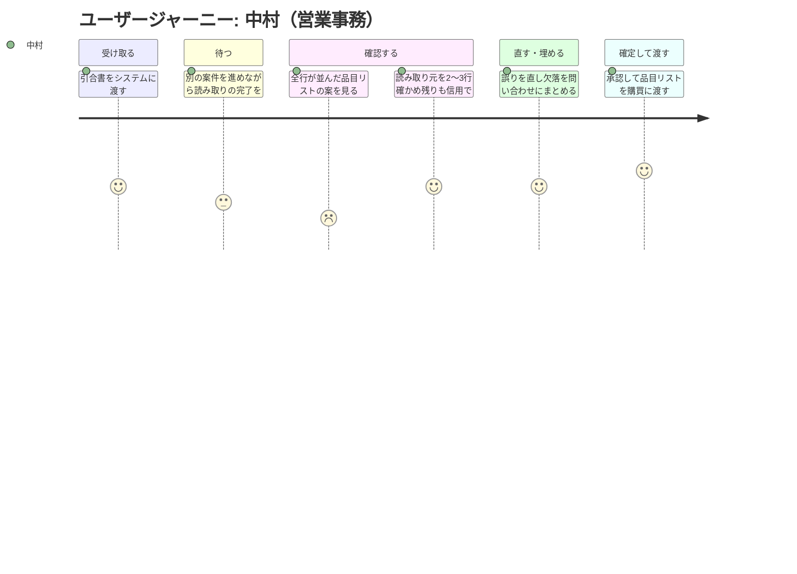

# 要求定義書: 引合書整理エージェント

> Vモデル: 要求分析 / 対応する検証: 受入テスト
> このプロジェクトで「誰の・どんな課題を・なぜ解決するか」を定義する。

> **本要求定義は、お題Aの前提（商社の引合書が Excel・PDF・メールで届き、手で品目リストに転記されている）に基づく想定シナリオです。実在の企業・取引先ではありません。**

## 1. 背景・課題

### 背景

産業機械向けの部品を扱う専門商社の、営業部・受注グループ（営業3名・営業事務2名）の業務である。

顧客（国内の機械メーカー）から届く「引合書」（見積依頼）を読み取り、社内の品目リスト（Excel）に転記する作業がある。この品目リストが、購買部門が仕入先に相見積を取るための起点になる。

きっかけは、四半期末の繁忙期に起きた失注である。引合が集中した週に見積回答が翌営業日にずれ込み、競合が先に提示して案件を落とした。原因を追うと、見積そのものではなく、**転記待ちで半日止まっていた**ことがわかった。

同じ時期に、型番の桁を1文字読み違えたまま見積を出し、受注後に差額を自社が被った案件も出た。「人が目で読んで写している」という構造そのものが限界に来ている、という話になった。

### 現状

**業務フロー**

1. 顧客の購買担当から、営業担当宛にメールで引合書が届く（添付 または 本文直書き）
2. 営業担当が内容をざっと見て、営業事務に転送する
3. 営業事務が添付を開き、社内の品目リスト（Excel の共通フォーマット）に手で転記する
   - 転記する項目: 品目名 / 型番 / 数量 / 単位 / 希望納期 / 備考
4. 転記済みの品目リストを購買部門に渡す。購買が仕入先に相見積を取る
5. 仕入先の回答が揃ったら、営業が見積書を作って顧客に返す

**引合書の形式（ここがバラバラ）**

| 形式 | 割合 | 実態 |
|------|------|------|
| Excel 添付 | 約5割 | 顧客ごとに独自フォーマットで、常時10種類以上が流通している |
| PDF 添付 | 約3割 | 顧客の基幹システム出力が大半。一部は手書き・FAX 由来のスキャン |
| メール本文に直書き | 約2割 | 箇条書きのことも、文章のこともある |

**規模と時間**

| 項目 | 値 |
|------|-----|
| 引合の件数 | 月40〜60件（繁忙期は月80件まで振れる） |
| 1件あたりの品目数 | 5〜30行（平均12行） |
| 1件あたりの転記時間 | 20〜40分（平均30分） |
| 月あたりの転記時間 | 約25時間（営業事務1名の月3日分。2名で分担している） |

### 課題一覧

| # | 課題 | 影響度 | 優先度 |
|---|------|--------|--------|
| 1 | **転記そのものに時間がかかる。** 月約25時間。繁忙期は転記待ちの行列ができ、見積回答が翌日にずれる。実際に失注の直接原因になった | 高 | 高 |
| 2 | **転記ミスが出る。** 月2〜3件（全体の4〜6%）。多いのは型番の桁違いと、数量の単位取り違え（本 / 箱 / m）。誤った見積を出すと、再見積で信用を損なうか、受注後に差額を自社が被る。①より件数は少ないが、1件あたりの損害は大きい | 高 | 高 |
| 3 | **顧客ごとにフォーマットが違う。** 新規顧客が増えるたびに「どこに何が書いてあるか」を覚え直す必要がある。結果としてベテラン1名に集中していて、その人が休むと止まる | 中 | 中 |
| 4 | **引合書の項目が欠けていることがある。** 全体の約2割（月10件前後）で、納期か数量のどちらかが書かれていない。顧客に問い合わせて返事が来るまで案件が止まる。欠けていることに転記の途中で気づくのが、余計に効率を落としている | 中 | 中 |
| 5 | **スキャン PDF が読み取りにくい。** 月に数件、手書きや FAX 由来で判読しづらいものがある。今は目視で頑張るか、電話で確認している。件数が少ないので優先度は低い | 低 | 低 |

## 2. ゴール

### ビジネスゴール

取り戻したいのは「見積回答のスピード」、防ぎたいのは「誤った見積の流出」と「属人化」の3点。

1. **繁忙期でも見積回答を当日中に返せる状態にする**
   転記待ちで半日止まることをなくし、失注の原因を潰す。
2. **誤った型番・数量のまま見積が外に出ることをなくす**
   再見積による信用の毀損と、受注後の差額負担をなくす。
3. **誰が担当しても同じ品質で処理できる状態にする**
   ベテラン1名への集中を解消し、その人が休んでも業務が止まらないようにする。

> **前提**: 品目リストは購買が相見積を取る起点になるため、内容の正しさは金額に直結する。したがって「人が確認せずに確定する」形は取らず、**確定の前に必ず担当者が内容をチェックする運用**を前提とする。

### ユーザーゴール

営業事務の仕事が「**白紙から写す**」から「**出てきたものを確認して直す**」に変わっている状態。

1. **引合書を渡すと、品目リストの形になったものが先に出てくる**
   ゼロから打ち込む作業がなくなる。
2. **どこから読み取った値かがすぐ確認できる**
   「この型番は元ファイルのどのセルから来たか」が示されるので、確認が目視の突き合わせで済み、原本を探し直さなくてよい。
3. **納期や数量の欠落が、転記の途中ではなく最初にまとめて分かる**
   「ここが埋まっていません」と先に提示されるので、顧客への問い合わせをまとめて1回で出せる。
4. **新規顧客の見慣れないフォーマットでも、同じ手順で扱える**
   「このお客さんの書式は誰々さんしか分からない」がなくなる。

1件あたりの体感としては、30分かけて写していたものが、10分程度の確認作業に置き換わっているイメージ。

### 成功指標（KPI）

| # | 指標 | 現在 | 目標値 | 測定方法 |
|---|------|------|--------|---------|
| 1 | 1件あたりの処理時間 | 平均30分（20〜40分） | **平均10分以内** | 引合書を渡してから品目リストを確定するまでの時刻差を記録する。連続する10件の平均で判定する |
| 2 | 確定後に外へ出た誤りの件数 | 月2〜3件（型番の桁違い・単位の取り違え） | **月0件** | 購買部門または顧客から指摘された誤りの件数を月次で数える。確認前の抽出誤りは対象外とし、人の確認を経て確定したものだけを数える |
| 3 | 欠落項目の事前提示率 | 転記の途中で気づく（事前には分からない） | **確定前に100%提示される** | 納期または数量が欠けている引合書10件を処理し、すべてについて確定前に「欠落あり」と提示されるかを確認する |
| 4 | 対応できる形式の範囲 | ベテラン1名に依存 | **Excel添付・PDF添付・メール本文直書きの3形式を、担当者を問わず処理できる** | 各形式2件ずつ計6件を、ベテラン以外の担当者が処理できるかを確認する |
| 5 | 品目リストの充足 | — | **生成された品目リストの全行に、品目名・型番・数量・単位・納期が埋まっている。元の引合書に記載がない項目は空欄にせず「要確認」と明示される** | 生成されたExcelを行単位で検査する。空欄が1つでもあれば未達とする |

業務全体では、月約25時間かかっている転記が月8時間程度になり、年間でおよそ200時間の削減にあたる。

## 3. ペルソナ

### ペルソナ1（メイン）: 中村 — 営業事務

| 項目 | 内容 |
|------|------|
| 名前 | 中村（仮名） |
| 年齢 | 30代後半 |
| 職業 | 営業事務（入社6年目） |
| 部門 | 営業部 受注グループ |
| 技術スキル | Excelは日常的に使い、VLOOKUPやSUMIFは自分で書ける。新しいツールには慎重で、「間違えたらどうしよう」が先に立つタイプ。プログラミングの経験はない |

**目標・ゴール**

- 引合が立て込む日でも、その日のうちに品目リストを購買部門に渡しきること
- 誤った型番や数量を自分のところで通してしまわないこと

**課題（ペインポイント）**

- 顧客ごとに書式が違うため、新規顧客の引合はまず「どこに何が書いてあるか」を探すところから始まる。自分では判断できず、ベテランの先輩に聞くことがある
- 転記を進めている途中で納期が書かれていないことに気づき、そこで手が止まる。顧客に問い合わせて返事を待つ間、その案件は進まない
- 型番の桁を間違えていないか不安で、最後にもう一度すべて見直している。この見直しに時間を取られている自覚がある
- 繁忙期は1日10件近く届き、その日のうちに終わらない日がある

**利用状況**

| 利用場面 | 頻度 | 詳細 |
|---------|------|------|
| 通常日の引合処理 | 1日3〜5件 | 朝一と夕方に集中して処理する。PCの前に腰を据えて作業する。引合書を開いて品目リストに打ち込み、打ち終わったら全体を見直してから購買に渡す |
| 繁忙期の引合処理 | 1日10件近く（通常の倍近く） | 件数が倍近くになり、後ろが詰まっていく。その日のうちに終わらない日がある |

### ペルソナ2: 高橋 — 営業担当

| 項目 | 内容 |
|------|------|
| 名前 | 高橋（仮名） |
| 年齢 | 40代前半 |
| 職業 | 営業担当 |
| 部門 | 営業部 |
| 技術スキル | メールが中心。Excelは開いて見る程度で、自分では作らない。顧客訪問が多く、外出先ではスマートフォンを使う |

**目標・ゴール**

- 顧客に見積を早く返し、競合より先に提示すること

**課題（ペインポイント）**

- 引合を営業事務に渡したあと、品目リストがいつできるのか分からない
- 急ぎの案件で「今どうなっていますか」と聞きに行くのが気まずく、かといって聞かないと顧客に回答の見込みを伝えられない
- 繁忙期に回答が翌日にずれ込み、実際に失注した案件がある

**利用状況**

| 利用場面 | 頻度 | 詳細 |
|---------|------|------|
| 引合メールを営業事務に渡す | 1日1〜3件 | 届いた引合メールを渡す。自分で転記はしない |
| 進捗の確認 | 引合の都度 | 外出先からスマートフォンで状況を見たい場面が多い |

### ペルソナ3: 石井 — 購買担当

| 項目 | 内容 |
|------|------|
| 名前 | 石井（仮名） |
| 年齢 | 30代前半 |
| 職業 | 購買担当 |
| 部門 | 購買部 |
| 技術スキル | Excelは得意で、関数もピボットも使う。社内システムの操作に慣れている |

**目標・ゴール**

- 受け取った品目リストを、そのまま仕入先への相見積に使える状態にすること

**課題（ペインポイント）**

- 型番や単位が誤っていると、仕入先から「この品番は存在しない」と差し戻され、営業事務に確認を戻すことになる。往復で半日から1日を失う
- 値が空欄のとき、「引合書に書かれていなかった」のか「転記が漏れた」のかが区別できず、毎回確認が必要になる

**利用状況**

| 利用場面 | 頻度 | 詳細 |
|---------|------|------|
| 確定した品目リストを受け取り、相見積に使う | 1日数件 | 確定した品目リストを受け取って、仕入先への見積依頼に使う。PCで作業する |

## 4. ユーザージャーニー

メインペルソナ中村の、この仕組みが入った後の行動フロー（引合1件が届いてから購買に渡すまで）。

### メインフロー

| # | フェーズ | 行動 | 課題・感情 | 解決 |
|---|---------|------|----------|------|
| 1 | 受け取る | 顧客から届いた引合メールを開き、添付ファイル（Excel または PDF）をシステムに投入する。本文に直接書かれている場合は、その本文を渡す | **スコア4**「開いて渡すだけでいい。ゼロから打ち込まなくていいのはありがたい」／顧客ごとに書式が違うので、投入する前に「この形式は扱えるのか」が分からず少し不安になる | 投入した時点で「Excel形式として受け付けました」のように、何として読もうとしているかが示される |
| 2 | 待つ | 読み取りが行われている間、別の案件の作業を進める | **スコア3**「どのくらいかかるんだろう。すぐ終わるなら待つし、時間がかかるなら先に他をやりたい」／進捗がまったく見えないと、結局画面の前から離れられず、他の作業に移れない | いまどの段階か（読み取り中／項目を抽出中／リストを作成中）と、おおよその残り時間が分かる |
| 3 | 確認する | 表示された品目リストの案を行ごとに確認する。それぞれの値が元の引合書のどこから読み取られたかを一緒に見る | **スコア2→4**（最初）「結局、全部の行を一から見直すなら、自分で打つのと変わらない」→（途中から）「この型番、元ファイルのこのセルから来ているのか。2〜3行そうやって確かめたら、残りも信用できそうだ」／全行が同じ見た目で並んでいると、どこを重点的に見ればいいか分からず、結局すべてを疑うことになる | 確信の持てない行や「要確認」の行が先に示され、重点的に見るべき箇所が分かる。各値について、元ファイルのどこから読み取ったかがすぐ確認でき、原本を探し直さなくて済む |
| 4 | 直す・埋める | 誤って読み取られている箇所を直す。引合書に書かれていない項目は「要確認」のまま残し、顧客に問い合わせる内容をまとめる | **スコア4**「足りないところが最初にまとまって出るから、お客さんに聞くことを1回でまとめられる」／欠落が複数あるときに一箇所にまとまっていないと、問い合わせを何度も分けて送ることになる | 欠落している項目が一覧で提示され、1通の問い合わせにまとめられる |
| 5 | 確定して渡す | 内容を確認したうえで承認し、確定する。品目リスト（Excel）が出力され、購買の石井に渡る | **スコア5**「今日届いた分を、今日のうちに購買に渡せた」／確定した後になって誤りが見つかると、石井から差し戻されて往復が発生する | まだ確認していない行が残っている状態では確定できず、「未確認の行があります」と止めてくれる |

### 感情の変化

- **開始時**（スコア3）: 期待と不安が半々。「本当にうちの引合書を読めるのだろうか」という気持ちがある。書式が顧客ごとに違うことを知っているぶん、半信半疑で試している
- **最初のつまずき**（スコア2）: 確認画面で品目リストの全行が並んでいるのを見た瞬間。「結局これを全部見るなら、自分で打つのと同じでは」と感じる。**ここが一番離脱しやすい場面**
- **ブレークスルー**（スコア4）: 各値がどこから読み取られたかを確認できると気づいたとき。元ファイルの該当箇所をその場で確かめられるので、2〜3行を確認したところで「残りも同じ精度で読めている」と判断できるようになる。確認が「全部を疑う作業」から「要確認の箇所だけを見る作業」に変わる
- **ゴール達成時**（スコア5）: 1件あたり30分かけていた転記が10分程度の確認作業になり、引合が立て込んだ日でも、その日のうちに購買へ渡しきれた。「型番を間違えていないか」と最後に全部見直す不安もなくなった

## 5. 利害関係者

| 区分 | 利害関係者 | 期待 |
|------|-----------|------|
| 利用者 | 中村（営業事務・メイン） | 打ち込む作業ではなく確認する作業に変えてほしい。ただし、何を根拠にその値が入ったのかが見える形であってほしい |
| 利用者 | 高橋（営業担当） | 引合を渡した後の進み具合が見えて、顧客に回答の見込みを伝えられるようにしてほしい |
| 利用者 | 石井（購買担当） | そのまま相見積に使える品目リストがほしい。空欄が「書かれていなかった」のか「漏れた」のかが区別できる形で |
| 社内 | 営業部長（中村・高橋の上長） | 繁忙期でも見積回答を当日中に返せるようにして、転記待ちによる失注をなくしてほしい。受注グループの残業も抑えたい |
| 社内 | ベテランの営業事務（中村の先輩・入社15年目） | 顧客ごとの読み方の質問が自分ひとりに集中している状態を解消したい。自分が休んでも受注業務が止まらないようにしてほしい。ただし、最終的な内容の正しさは人が責任を持つ形であってほしい。「機械が出したから正しい」という運用にはしたくない |
| 社内 | 購買部長 | 型番や単位の誤りによる仕入先からの差し戻しをなくしてほしい。引合を受け取ってから相見積に入るまでの時間を短くしたい |
| 社内 | 情報システム部門 | 顧客から受け取った引合書は社外から預かった文書なので、どこに保管され、誰が閲覧でき、いつ消えるのかを明確にしてほしい。また、日々の運用の手間が情シスに寄ってこない形にしてほしい |
| 社内 | 経営層 | 受注の機会損失を減らしたい。人員を増やさずに引合件数の増加に対応できる状態にしたい |
| 社外 | 顧客（機械メーカーの購買担当） | 見積の回答が早く、品番と金額が正確であってほしい。なお、こちらの都合で引合書の書式を統一・変更することは求めないでほしい。自社の基幹システムから出力している形式をそのまま送りたい |
| 社外 | 仕入先 | 正しい品番・数量・納期で見積依頼が来てほしい。存在しない品番の問い合わせで手間を取られたくない |

---

## 次のステップ

→ `/design-problem-check` で課題定義フェーズのレビューを行い、指摘を自分で修正する
→ `02-requirement`（要件定義書）で機能一覧・要件・スコープ・非機能要件を定義する
