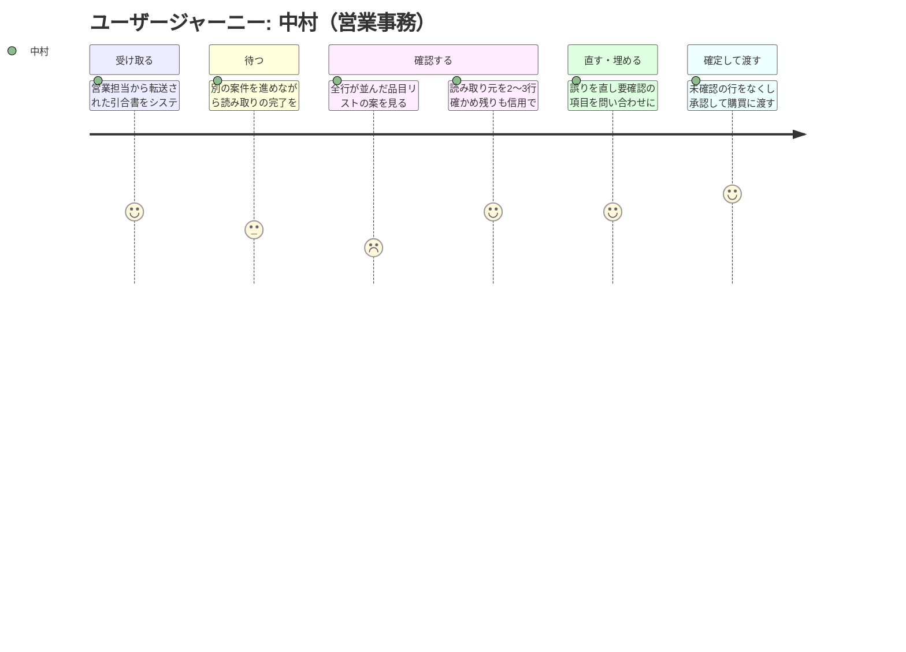

# 要求定義書: 引合書整理エージェント

> Vモデル: 要求分析 / 対応する検証: 受入テスト
> このプロジェクトで「誰の・どんな課題を・なぜ解決するか」を定義する。

> **本要求定義は、お題Aの前提（商社の引合書が Excel・PDF・メールで届き、手で品目リストに転記されている）に基づく想定シナリオです。実在の企業・取引先ではありません。**

## 1. 背景・課題

### 背景

産業機械向けの部品を扱う専門商社の、営業部・受注グループ（営業3名・営業事務2名）の業務である。

顧客（国内の機械メーカー）から届く「引合書」（見積依頼）を読み取り、社内の品目リスト（Excel）に転記する作業がある。この品目リストが、購買部門が仕入先に相見積を取るための起点になる。

きっかけは、四半期末の繁忙期に起きた失注である。引合が集中した週に見積回答が翌営業日にずれ込み、競合が先に提示して案件を落とした。原因を追うと、見積そのものではなく、**転記待ちで半日止まっていた**ことがわかった。

同じ時期に、型番の桁を1文字読み違えたまま見積を出し、受注後に差額を自社が被った案件も出た。「人が目で読んで写している」という構造そのものが限界に来ている、という話になった。

### 現状

**業務フロー**

1. 顧客の購買担当から、営業担当宛にメールで引合書が届く（添付 または 本文直書き）
2. 営業担当が内容をざっと見て、営業事務に転送する
3. 営業事務が添付を開き、社内の品目リスト（Excel の共通フォーマット）に手で転記する
   - 転記する項目: 品目名 / 型番 / 数量 / 単位 / 納期 / 備考
4. 転記済みの品目リストを購買部門に渡す。購買が仕入先に相見積を取る
5. 仕入先の回答が揃ったら、営業が見積書を作って顧客に返す

**引合書の形式（ここがバラバラ）**

| 形式 | 割合 | 実態 |
|------|------|------|
| Excel 添付 | 約5割 | 顧客ごとに独自フォーマットで、常時10種類以上が流通している |
| PDF 添付 | 約3割 | 顧客の基幹システム出力が大半。一部は手書き・FAX 由来のスキャン |
| メール本文に直書き | 約2割 | 箇条書きのことも、文章のこともある |

**規模と時間**

| 項目 | 値 |
|------|-----|
| 引合の件数 | 月40〜60件（繁忙期は月80件まで振れる） |
| 1件あたりの品目数 | 5〜30行（平均12行） |
| 1件あたりの転記時間 | 20〜40分（平均30分） |
| 月あたりの転記時間 | 約25時間（営業事務1名の月3日分。2名で分担している） |

### 課題一覧

| # | 課題 | 影響度 | 優先度 |
|---|------|--------|--------|
| 1 | **転記そのものに時間がかかる。** 月約25時間。繁忙期は転記待ちの行列ができ、見積回答が翌日にずれる。実際に失注の直接原因になった | 高 | 高 |
| 2 | **転記ミスが出る。** 月2〜3件（全体の4〜6%）。多いのは型番の桁違いと、数量の単位取り違え（本 / 箱 / m）。誤った見積を出すと、再見積で信用を損なうか、受注後に差額を自社が被る。①より件数は少ないが、1件あたりの損害は大きい | 高 | 高 |
| 3 | **顧客ごとにフォーマットが違う。** 新規顧客が増えるたびに「どこに何が書いてあるか」を覚え直す必要がある。結果としてベテラン1名に集中していて、その人が休むと止まる | 中 | 中 |
| 4 | **引合書の項目が欠けていることがある。** 全体の約2割（月10件前後）で、納期か数量のどちらかが書かれていない。顧客に問い合わせて返事が来るまで案件が止まる。欠けていることに転記の途中で気づくのが、余計に効率を落としている | 中 | 中 |
| 5 | **スキャン PDF が読み取りにくい。** 月に数件、手書きや FAX 由来で判読しづらいものがある。今は目視で頑張るか、電話で確認している。件数が少ないので優先度は低い | 低 | 低 |

> **課題5は今回の対象外とする。** 手書き・FAX 由来のスキャンを判読することはゴールに含めない。
> ただし**捨てるのではなく、「読み取り不可」と判定して人に引き渡す**。判読できないものを黙って空欄で通すと、課題2（誤りの流出）を悪化させるため。
> この「読み取り不可として引き渡す」動作は、異常系として検証の対象に含める。

### 用語の定義

以降の章で繰り返し使うため、紛らわしい3語をここで分ける。**この3つはそれぞれ別物である。**

| 用語 | 意味 | 何の状態か | 確定を止めるか |
|------|------|-----------|--------------|
| **未確認** | 中村がその行をまだ見ていない | **人の作業状態** | **止める** |
| **確信が低い** | 値は読み取れたが、読み違いの疑いがある | **読み取りの状態** | 止めない（中村に優先的に見せる印） |
| **要確認** | 引合書に記載がなく、顧客に問い合わせる必要がある | **データの状態** | 止めない（顧客回答待ちとして渡る） |

**「確信が低い」と「要確認」を混同しないこと。** 読み違いの疑いは顧客に聞く話ではないため、
これを「要確認」として扱うと、誤りが「顧客回答待ち」のまま購買へ流れてしまい、**ビジネスゴール2（誤った値を外に出さない）と衝突する。**

#### 確定の条件と、「未確認を0にする」操作

- **確定できる条件は「未確認の行が0であること」。**
- **要確認の行が残っていても確定でき、購買へ渡せる。** その行は「顧客回答待ち」と分かる形で渡り、購買は残りの行で相見積に入れる。

「未確認を0にする」ために中村が行う操作は、行の種類によって異なる。

| 行の種類 | 中村の操作 |
|---------|----------|
| **要確認**の行 / **確信が低い**行 | **1行ずつ**内容と読み取り元を確認する |
| **確信が高い**行 | 読み取り元を**何行か抜き取りで**確かめたうえで、**まとめて確認済みにできる** |

全行を1行ずつ開く必要はない。これが、中村が「2〜3行を確かめれば残りも信用できる」と判断できる根拠であり、
1件あたり10分（KPI1）に収まる根拠でもある。平均12行のうち、1行ずつ見る必要があるのは要確認と確信が低い行だけになる。

#### 顧客から返事が来た後（今回の対象外）

要確認の行は「顧客回答待ち」として購買に渡る。**その後の流れ（返事の受領 → 品目リストの修正 → 購買への渡し直し）は今回の対象外とする。**
月10件前後（全体の約2割）が通る道だが、現在の運用のまま扱う。すなわち、返事はこれまでどおりメールで受け取り、
修正は確定済みの品目リスト（Excel）を直接編集して購買に渡し直す。**この往復をシステム上で扱うことは、次の段階の課題とする。**

## 2. ゴール

### ビジネスゴール

取り戻したいのは「購買へ渡すまでのスピード」、防ぎたいのは「誤った見積の流出」と「属人化」の3点。

1. **繁忙期でも、引合を受け取った当日中に品目リストを購買部門へ渡しきる**
   転記待ちで半日止まることをなくす。

   > 当初は「見積回答を当日中に返す」をゴールに置いていたが、**見積回答は仕入先の回答が揃ってから出るもので、転記を速くしても仕入先の返事は変わらない。** この取り組みで動かせるのは「購買へ渡すまで」であり、到達点をそこに置き直した。見積回答の早期化は、その結果として期待される効果と位置づける。

2. **誤った型番・数量のまま見積が外に出ることをなくす**
   再見積による信用の毀損と、受注後の差額負担をなくす。
3. **誰が担当しても同じ品質で処理できる状態にする**
   ベテラン1名への集中を解消し、その人が休んでも業務が止まらないようにする。

### 前提・制約

ゴールではなく、**守るべき条件**として扱うもの。要件定義（02）の非機能要件に引き継ぐ。

| # | 前提・制約 | 出どころ |
|---|-----------|---------|
| 1 | **確定の前に必ず担当者が内容をチェックする。** 品目リストは購買が相見積を取る起点であり、内容の正しさが金額に直結するため、「人が確認せずに確定する」形は取らない | ベテラン営業事務「機械が出したから正しい、という運用にはしたくない」 |
| 2 | **顧客に引合書の書式の統一・変更を求めない。** 顧客は自社の基幹システムから出力した形式をそのまま送る。こちらが書式を揃えてもらう形の解決は取れない | 顧客（機械メーカーの購買担当） |
| 3 | **預かった文書の保管場所・閲覧できる範囲・保持期間を明確にする。** 引合書は社外から預かった文書である | 情報システム部門 |
| 4 | **日々の運用の手間が情報システム部門に寄らない形にする** | 情報システム部門 |
| 5 | **引合は営業担当が営業事務へ転送する現在のフローを変えない。** 顧客からの受信経路そのものは今回の対象としない | 現状フロー（1章） |

### ユーザーゴール

営業事務の仕事が「**白紙から写す**」から「**出てきたものを確認して直す**」に変わっている状態。

1. **引合書を渡すと、品目リストの形になったものが先に出てくる**
   ゼロから打ち込む作業がなくなる。
2. **どこから読み取った値かがすぐ確認できる**
   確認が目視の突き合わせで済み、原本を探し直さなくてよい。読み取り元の示し方は形式によって異なる。

   | 形式 | 読み取り元の示し方 |
   |------|-----------------|
   | Excel 添付 | シート名とセル番地（例: `明細!C12`） |
   | PDF 添付 | ページ番号と、そのページ内の該当箇所 |
   | メール本文 | 本文の何行目か |

3. **納期や数量の欠落が、転記の途中ではなく最初にまとめて分かる**
   「ここが埋まっていません」と先に提示されるので、顧客への問い合わせをまとめて1回で出せる。
4. **新規顧客の見慣れないフォーマットでも、同じ手順で扱える**
   「このお客さんの書式は誰々さんしか分からない」がなくなる。
5. **営業担当が、営業事務に聞かずに処理状況を確認できる**
   高橋が「今どうなっていますか」と聞きに行かなくても、顧客に回答の見込みを伝えられる。

1件あたりの体感としては、30分かけて写していたものが、10分程度の確認作業に置き換わっているイメージ。

### 成功指標（KPI）

**区分**は、その指標を何で確かめるかを表す。**受入**は受入テストで確かめられるもの、**運用**は実際に運用を回して初めて測れるもの。

| # | 指標 | 区分 | 現在 | 目標値 | 測定方法 |
|---|------|------|------|--------|---------|
| 1 | 1件あたりの中村の作業時間 | 受入 | 平均30分（20〜40分） | **平均10分以内** | **確認画面が表示された時刻から、確定した時刻までの差**を記録する。連続する10件の平均で判定する。この取り方により、読み取りの完了待ち（中村が別の作業をしている時間）は自然に除かれる。**顧客の返事待ちも含めない**（要確認の行は残したまま確定できるため）。※引合の受領から購買への受け渡しまでの全体のリードタイムは KPI6 で別に測る |
| 2 | 確定後に外へ出た誤りの件数 | 運用 | 月2〜3件（型番の桁違い・単位の取り違え） | **月0件** | 購買部門または顧客から指摘された誤りの件数を月次で数える。確認前の抽出誤りは対象外とし、人の確認を経て確定したものだけを数える |
| 3 | 欠落項目の事前提示率 | 受入 | 転記の途中で気づく（事前には分からない） | **確定前に100%提示される** | 納期または数量が欠けている引合書10件を処理し、すべてについて確定前に「欠落あり」と提示されるかを確認する |
| 4 | 対応できる形式の範囲 | 受入 | ベテラン1名に依存 | **6件すべてを、ベテランに一度も聞かずに、1件10分以内（KPI1 と同じ取り方）で確定できる。誤りの見逃しは0件** | Excel添付・PDF添付・メール本文直書きを各2件ずつ計6件、ベテラン以外の担当者が処理する。**うち2件は、その担当者が初めて見る書式とする**（課題3の核心が「新規顧客の見慣れない書式」であるため） |
| 5 | 品目リストの充足 | 受入 | 空欄が「引合書に書かれていなかった」のか「転記が漏れた」のか区別できない | **全行に品目名・型番・数量・単位・納期が埋まっている。引合書に記載がない項目は空欄にせず「要確認」と明示される** | 生成されたExcelを行単位で検査する。区別のつかない空欄が1つでもあれば未達とする |
| 6 | 当日中の受け渡し率 | 運用 | 繁忙期は翌営業日にずれ込む | **その日に届いた引合の100%を、その日のうちに購買へ渡す** | その日に受け取った引合のうち、同日中に品目リストを購買へ渡せた割合を数える。**繁忙期に測る**（平常時は現状でも渡せているため） |
| 7 | 処理状況の可視性 | 受入 | 営業事務に聞かないと分からない | **営業担当が、営業事務に問い合わせずに処理状況を確認できる** | 引合を投入してから確定するまでの各段階（**受付済み／読み取り中／読み取り不可／確認待ち／確定済み**）について、営業担当が自分で状況を確認できることを確かめる。**読み取り不可を含める**のは、課題5で「読み取り不可として人に引き渡す」と決めたため。この状態が見えないと、営業担当は読み取れなかった案件の状況が分からない |
| 8 | 誤りの検知 | 受入 | 最後に全行を見直して人が気づくしかない | **仕込んだ誤りが、確定前に「確信が低い行」として示される** | 型番の桁違いと単位の取り違えを仕込んだ引合書を処理し、確定前にその行が「確信が低い」と提示されるかを確認する。**「要確認」ではない**（読み違いは顧客に問い合わせる話ではないため。用語の定義を参照）。**KPI2 を受入テストで確かめるための代替指標** |

業務全体では、月約25時間かかっている転記が月8時間程度になり、年間でおよそ200時間の削減にあたる。

## 3. ペルソナ

### ペルソナ1（メイン）: 中村 — 営業事務

| 項目 | 内容 |
|------|------|
| 名前 | 中村（仮名） |
| 年齢 | 30代後半 |
| 職業 | 営業事務（入社6年目） |
| 部門 | 営業部 受注グループ |
| 技術スキル | Excelは日常的に使い、VLOOKUPやSUMIFは自分で書ける。新しいツールには慎重で、「間違えたらどうしよう」が先に立つタイプ。プログラミングの経験はない |

**目標・ゴール**

- 引合が立て込む日でも、その日のうちに品目リストを購買部門に渡しきること
- 誤った型番や数量を自分のところで通してしまわないこと

**課題（ペインポイント）**

- 顧客ごとに書式が違うため、新規顧客の引合はまず「どこに何が書いてあるか」を探すところから始まる。自分では判断できず、ベテランの先輩に聞くことがある
- 転記を進めている途中で納期が書かれていないことに気づき、そこで手が止まる。顧客に問い合わせて返事を待つ間、その案件は進まない
- 型番の桁を間違えていないか不安で、最後にもう一度すべて見直している。この見直しに時間を取られている自覚がある
- 繁忙期は1日4〜5件が短い期間に集中し、受注入力や納期回答といった他の業務と重なる。結果として、その日のうちに購買へ渡しきれない日が出る

**利用状況**

| 利用場面 | 頻度 | 詳細 |
|---------|------|------|
| 通常日の引合処理 | 1日1〜2件 | 朝一と夕方に処理する。PCの前に腰を据えて作業する。引合書を開いて品目リストに打ち込み、打ち終わったら全体を見直してから購買に渡す |
| 繁忙期の引合処理 | 1日4〜5件 | 四半期末に集中する。他の受注業務と重なり、後ろが詰まっていく |

> **件数の整合**: 受注グループ全体で月40〜60件（約20営業日）。営業事務2名で分担するため、中村1人あたりは1日1〜2件になる。繁忙期（月80件）は四半期末に集中するため、1日4〜5件まで振れる。

### ペルソナ2: 高橋 — 営業担当

| 項目 | 内容 |
|------|------|
| 名前 | 高橋（仮名） |
| 年齢 | 40代前半 |
| 職業 | 営業担当 |
| 部門 | 営業部 |
| 技術スキル | メールが中心。Excelは開いて見る程度で、自分では作らない。顧客訪問が多く、外出先ではスマートフォンを使う |

**目標・ゴール**

- 顧客に見積を早く返し、競合より先に提示すること

**課題（ペインポイント）**

- 引合を営業事務に渡したあと、品目リストがいつできるのか分からない
- 急ぎの案件で「今どうなっていますか」と聞きに行くのが気まずく、かといって聞かないと顧客に回答の見込みを伝えられない
- 繁忙期に回答が翌日にずれ込み、実際に失注した案件がある

**利用状況**

| 利用場面 | 頻度 | 詳細 |
|---------|------|------|
| 引合メールを営業事務に転送する | 週3〜5件 | 届いた引合メールを営業事務に転送する。自分で転記はしない |
| 処理状況の確認 | 引合の都度 | 外出先からスマートフォンで状況を見たい場面が多い（対応端末の要否は要件定義で判断する） |

> **件数の整合**: 受注グループ全体で月40〜60件を営業3名で受けるため、高橋1人あたりは週3〜5件になる。

### ペルソナ3: 石井 — 購買担当

| 項目 | 内容 |
|------|------|
| 名前 | 石井（仮名） |
| 年齢 | 30代前半 |
| 職業 | 購買担当 |
| 部門 | 購買部 |
| 技術スキル | Excelは得意で、関数もピボットも使う。社内システムの操作に慣れている |

**目標・ゴール**

- 受け取った品目リストを、そのまま仕入先への相見積に使える状態にすること

**課題（ペインポイント）**

- 型番や単位が誤っていると、仕入先から「この型番は存在しない」と差し戻され、営業事務に確認を戻すことになる。往復で半日から1日を失う
- 値が空欄のとき、「引合書に書かれていなかった」のか「転記が漏れた」のかが区別できず、毎回確認が必要になる

**利用状況**

| 利用場面 | 頻度 | 詳細 |
|---------|------|------|
| 確定した品目リストを受け取り、相見積に使う | 1日数件 | 確定した品目リストを受け取って、仕入先への見積依頼に使う。PCで作業する |

## 4. ユーザージャーニー

メインペルソナ中村の、この仕組みが入った後の行動フロー（引合1件が届いてから購買に渡すまで）。

### メインフロー

| # | フェーズ | 行動（To-Be） | 今はどうだったか（As-Is） | 課題・感情 | 解決 |
|---|---------|--------------|------------------------|----------|------|
| 1 | 受け取る | 営業担当から転送された引合メールを開き、添付ファイル（Excel / PDF）をシステムに投入する。本文に直接書かれている場合は、その本文を渡す | 同じように転送を受け取るが、ここから自分で読んで打ち込む作業が始まる | **スコア4**「開いて渡すだけでいい。ゼロから打ち込まなくていいのはありがたい」／顧客ごとに書式が違うので、投入する前に「この形式は扱えるのか」が分からず少し不安になる | 投入した時点で、何として読もうとしているか（Excel / PDF / メール本文）が示される。扱えない場合はその場で「読み取り不可」と分かる |
| 2 | 待つ | 読み取りが行われている間、別の案件の作業を進める。この間、営業担当も自分で処理状況を確認できる | 待ち時間はない代わりに、自分が手を動かし続けている。営業担当は状況が分からず、聞きに来る | **スコア3**「どのくらいかかるんだろう。すぐ終わるなら待つし、時間がかかるなら先に他をやりたい」／進捗がまったく見えないと、結局画面の前から離れられず、他の作業に移れない | いまどの段階か（受付済み／読み取り中／**読み取り不可**／確認待ち／確定済み）と、おおよその残り時間が分かる |
| 3 | 確認する | 表示された品目リストの案を行ごとに確認する。それぞれの値が元の引合書のどこから読み取られたかを一緒に見る | 打ち終わった後に、原本と品目リストを並べて全行を目視で突き合わせる。原本のどこを見ていたか分からなくなり、探し直すことがある | **スコア2→4**（最初）「結局、全部の行を一から見直すなら、自分で打つのと変わらない」→（途中から）「この型番、元ファイルのここから来ているのか。2〜3行そうやって確かめたら、残りも信用できそうだ」／全行が同じ見た目で並んでいると、どこを重点的に見ればいいか分からず、結局すべてを疑うことになる | **確信が低い行**と**要確認**の行が先に示され、重点的に見るべき箇所が分かる。各値について読み取り元（Excel はシート名とセル番地、PDF はページと該当箇所、メール本文は行番号）がすぐ確認でき、原本を探し直さなくて済む。**確信が高い行は、抜き取りで確かめたうえでまとめて確認済みにできる** |
| 4 | 直す・埋める | 誤って読み取られている箇所を直す。引合書に記載のない項目は「要確認」のまま残し、顧客に問い合わせる内容をまとめる | 転記の途中で欠落に気づいて手が止まる。気づくたびに顧客へ個別に問い合わせることになる | **スコア4**「足りないところが最初にまとまって出るから、お客さんに聞くことを1回でまとめられる」／欠落が複数あるときに一箇所にまとまっていないと、問い合わせを何度も分けて送ることになる | 要確認の項目が一覧で提示され、1通の問い合わせにまとめられる |
| 5 | 確定して渡す | 未確認の行をなくしたうえで承認し、確定する（要確認と確信が低い行は1行ずつ、確信が高い行はまとめて確認済みにする）。品目リスト（Excel）が出力され、購買の石井に渡る。**要確認の行が残っていても確定でき、その行は「顧客回答待ち」と分かる形で渡る** | 見直しを終えたら購買に渡す。空欄があっても、それが「書かれていなかった」のか「打ち漏らした」のかは伝わらない | **スコア5**「今日届いた分を、今日のうちに購買に渡せた」／確定した後になって誤りが見つかると、石井から差し戻されて往復が発生する | **未確認の行（まだ見ていない行）が残っている状態では確定できず**、「未確認の行があります」と止めてくれる。要確認の行は残っていても確定を妨げない |

### 感情の変化

- **開始時**（スコア3）: 期待と不安が半々。「本当にうちの引合書を読めるのだろうか」という気持ちがある。書式が顧客ごとに違うことを知っているぶん、半信半疑で試している
- **最初のつまずき**（スコア2）: 確認画面で品目リストの全行が並んでいるのを見た瞬間。「結局これを全部見るなら、自分で打つのと同じでは」と感じる。**ここが一番離脱しやすい場面**
- **ブレークスルー**（スコア4）: 各値がどこから読み取られたかを確認できると気づいたとき。元ファイルの該当箇所をその場で確かめられるので、確信が高い行を2〜3行だけ抜き取りで確認したところで「残りも同じ精度で読めている」と判断し、まとめて確認済みにできるようになる。確認が「全部を疑う作業」から「**確信が低い行と要確認の行だけを1行ずつ見る作業**」に変わる
- **ゴール達成時**（スコア5）: 1件あたり30分かけていた転記が10分程度の確認作業になり、引合が立て込んだ日でも、その日のうちに購買へ渡しきれた。顧客の返事待ちがある案件も、要確認の行を残したまま渡せるので止まらない。「型番を間違えていないか」と最後に全部見直す不安もなくなった

## 5. 利害関係者

| 区分 | 利害関係者 | 期待 |
|------|-----------|------|
| 利用者 | 中村（営業事務・メイン） | 打ち込む作業ではなく確認する作業に変えてほしい。ただし、何を根拠にその値が入ったのかが見える形であってほしい |
| 利用者 | 高橋（営業担当） | 引合を渡した後の進み具合が見えて、顧客に回答の見込みを伝えられるようにしてほしい（→ ユーザーゴール5・KPI7） |
| 利用者 | 石井（購買担当） | そのまま相見積に使える品目リストがほしい。空欄が「書かれていなかった」のか「漏れた」のかが区別できる形で |
| 社内 | 営業部長（中村・高橋の上長） | 繁忙期でも見積回答を当日中に返せるようにして、転記待ちによる失注をなくしてほしい。受注グループの残業も抑えたい |
| 社内 | ベテランの営業事務（中村の先輩・入社15年目） | 顧客ごとの読み方の質問が自分ひとりに集中している状態を解消したい。自分が休んでも受注業務が止まらないようにしてほしい。ただし、最終的な内容の正しさは人が責任を持つ形であってほしい。「機械が出したから正しい」という運用にはしたくない（→ **前提・制約1**） |
| 社内 | 購買部長 | 型番や単位の誤りによる仕入先からの差し戻しをなくしてほしい。引合を受け取ってから相見積に入るまでの時間を短くしたい |
| 社内 | 情報システム部門 | 顧客から受け取った引合書は社外から預かった文書なので、どこに保管され、誰が閲覧でき、いつ消えるのかを明確にしてほしい。また、日々の運用の手間が情シスに寄ってこない形にしてほしい（→ **前提・制約3・4**。KPI ではなく非機能要件として 02 で定義する） |
| 社内 | 経営層 | 受注の機会損失を減らしたい。人員を増やさずに引合件数の増加に対応できる状態にしたい |
| 社外 | 顧客（機械メーカーの購買担当） | 見積の回答が早く、型番と金額が正確であってほしい。なお、こちらの都合で引合書の書式を統一・変更することは求めないでほしい。自社の基幹システムから出力している形式をそのまま送りたい（→ **前提・制約2**） |
| 社外 | 仕入先 | 正しい型番・数量・納期で見積依頼が来てほしい。存在しない型番の問い合わせで手間を取られたくない |

---

## 要件定義（02）で決めること ※4件とも 02 で決着済み

本書の範囲では決めきらず、機能一覧を作る段階で決めればよいものを、忘れないようにここに残す。

| # | 決めること | 02 での決着 |
|---|-----------|---------------------|
| 1 | **要確認の行を残して確定した案件が、営業担当からどう見えるか。** KPI7 の段階では「確定済み」としか出ないが、実際には顧客の返事待ちが残っている。顧客と話すのは高橋なので、ユーザーゴール5（顧客に回答の見込みを伝えられる）から考えると、返事待ちが残っていることが見えたほうが自然 | FUNC-08 を Scope 2 としたため、Scope 2 の着手時に決める |
| 2 | **ステップ4でまとめた問い合わせを顧客に送るのは、中村か高橋か** | 中村。送信は Out of Scope のため、現行どおりメールで手作業で送る |
| 3 | **預かった文書の保管場所・閲覧できる範囲・保持期間**（前提・制約3） | 非機能（セキュリティ）に記載。保管はローカル内に限定、閲覧は営業事務ロールのみ、保持期間は確定した案件は確定日から90日・確定に至らなかった案件は投入日から90日（いずれも期限後に削除。自動削除の実装は FUNC-10・今回は対象外） |
| 4 | **営業担当がスマートフォンから処理状況を見られる必要があるか**（ペルソナ2の利用状況） | FUNC-08 を Scope 2 としたため、Scope 2 の着手時に判断（非機能・ユーザビリティに記載済み） |

---

## 次のステップ

→ ~~`/design-problem-check` で課題定義フェーズのレビューを行い、指摘を自分で修正する~~
  **完了**（3回実施。1回目12件・2回目6件を反映し、3回目で指摘ゼロ）
→ `02-requirement`（要件定義書）で機能一覧・要件・スコープ・非機能要件を定義する
