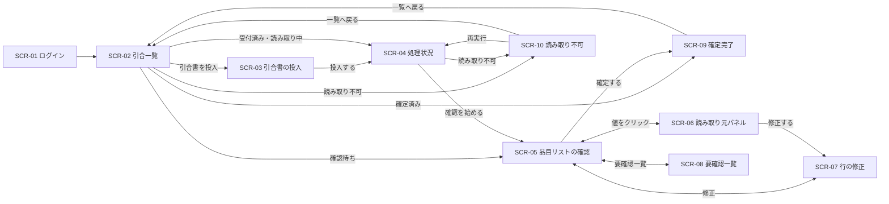

# 仕様書（基本設計）: 引合書整理エージェント

> Vモデル: 基本設計 / 対応する検証: 結合テスト
> 要件（②）を画面に落とし込む。画面構成・画面ごとの機能・モックHTMLを定義する。
> モックは全画面を1つにまとめた [mocks/mockup.html](./mocks/mockup.html) に作成する（画面ID `#SCR-xx` で各画面へアンカー移動）。

## 1. 画面構成（サイトマップ）

> **本書は Scope 1 の範囲を対象とする。** Scope 2 の FUNC-08（営業担当による処理状況確認）の画面は、Scope 2 の着手時に本書へ追補する。

| 画面ID | 画面名 | 目的 | 対応機能(②) | モック |
|--------|-------|------|-------------|-------|
| SCR-01 | ログイン | 営業事務としてサインインする（Scope 1 は営業事務ロールのみ） | 非機能・セキュリティ | [mockup.html#SCR-01](./mocks/mockup.html#SCR-01) |
| SCR-02 | 引合一覧 | 案件を5段階の状況と残り時間つきで一覧し、次に手を付ける案件を選ぶ。新規投入の入口 | FUNC-03 | [mockup.html#SCR-02](./mocks/mockup.html#SCR-02) |
| SCR-03 | 引合書の投入 | 1件の引合として、複数のファイルとメール本文をまとめて投入する。ファイルごとの判定結果と、拒否の理由を見せる | FUNC-01 | [mockup.html#SCR-03](./mocks/mockup.html#SCR-03) |
| SCR-04 | 処理状況 | 1件の段階の移り変わりと残り時間の目安を見せる。確認待ちになったら確認画面へ進める | FUNC-03 | [mockup.html#SCR-04](./mocks/mockup.html#SCR-04) |
| SCR-05 | 品目リストの確認 | 抽出結果を3分類で並べ、1行ずつ／一括で確認済みにし、確定する。HITL の本体 | FUNC-04 / FUNC-05 / FUNC-06 | [mockup.html#SCR-05](./mocks/mockup.html#SCR-05) |
| SCR-06 | 読み取り元パネル | 選んだ値の読み取り元（ファイル名と場所）を、原本の抜粋と一緒に見せる（SCR-05 に重ねて開く） | FUNC-04 | [mockup.html#SCR-06](./mocks/mockup.html#SCR-06) |
| SCR-07 | 行の修正 | 1行の値を直す。納期は (a)(b)(c) のいずれかでないと保存できない（SCR-05 に重ねて開く） | FUNC-05 | [mockup.html#SCR-07](./mocks/mockup.html#SCR-07) |
| SCR-08 | 要確認一覧 | 顧客に問い合わせる項目を1画面にまとめる。Scope 3 の問い合わせ文面もここに出す | FUNC-05 / FUNC-09 | [mockup.html#SCR-08](./mocks/mockup.html#SCR-08) |
| SCR-09 | 確定完了（確定済みの閲覧） | 品目リスト（Excel）をダウンロードする。確定済みの案件を開き直したときもこの画面で、読み取り専用で見せる | FUNC-06 | [mockup.html#SCR-09](./mocks/mockup.html#SCR-09) |
| SCR-10 | 読み取り不可 | 理由と読めた範囲を見せ、理由に応じて再実行または原本のダウンロードに進める | FUNC-07 | [mockup.html#SCR-10](./mocks/mockup.html#SCR-10) |

**必須4画面との対応**（計画書）: アップロード = SCR-03 ／ 進捗 = SCR-04 ／ HITL 確認 = SCR-05 ／ ダウンロード = SCR-09

### 画面遷移図

SCR-06・SCR-07 は SCR-05 の上に重ねて開く（パネル・ダイアログ）。独立したページではない。
SCR-02〜SCR-10 は共通のヘッダー（製品名・ログイン中のユーザー名・ログアウト）を持つ。

### 本書で画面にしないもの

| 項目 | 画面にしない理由 |
|------|----------------|
| 読み取り不可の案件で、読めた範囲を土台に残りを手で入力する | 読み取れなかった行はそもそも行として存在しないため、FUNC-06 の確定条件「未確認の行が0であること」が判定できなくなる。中途半端に埋まったリストが購買に流れるリスクもある。**Out of Scope** とし、判読不能のときはシステムの外で今までどおり Excel に転記する（SCR-10） |
| 確定済みの案件の修正 | 確定後の修正は Out of Scope（確定済みの Excel を直接編集する運用。② Out of Scope）。SCR-09 は読み取り専用とし、直せないことを画面上で明示する |
| 営業担当の処理状況確認（FUNC-08） | Scope 2。01 の持ち越し #1 が未決のため、Scope 2 の着手時に追補する |

## 2. 画面ごとの仕様

### SCR-01 ログイン

**目的**: 営業事務としてサインインし、引合一覧へ進む。

**UI要素**

| 要素 | 説明 | 位置 | 対応機能(②) |
|------|------|------|-------------|
| ユーザーID入力 | 営業事務のユーザーID | 中央のフォーム | 非機能・セキュリティ |
| パスワード入力 | 入力は伏せ字で表示 | 中央のフォーム | 非機能・セキュリティ |
| 「ログイン」ボタン | primary | フォームの下 | 非機能・セキュリティ |
| メッセージ領域 | 認証失敗・ログイン期限切れを表示 | フォームの上 | 非機能・セキュリティ |

**操作とインタラクション**

| 操作 | UI要素 | 挙動 | 対応機能(②) |
|------|--------|------|-------------|
| IDとパスワードを入れてログインする | 「ログイン」ボタン | 認証に成功すると SCR-02 へ。アクセストークン（有効期限 60分）を保持する | 非機能・セキュリティ |
| パスワード欄で Enter | パスワード入力 | 「ログイン」ボタンと同じ | 非機能・セキュリティ |

**エラー・例外表示**

> 業務ルール（②の例外・バリデーション）を、この画面でどう見せる・どう振る舞うかを定義する。

| ケース | トリガー | 画面の挙動・表示 | 対応する要件(②) |
|--------|---------|----------------|----------------|
| 認証失敗 | IDまたはパスワードが違う | メッセージ領域に「ユーザーIDまたはパスワードが違います」。どちらが違うかは出さない。パスワード欄だけ空にする | 非機能・セキュリティ |
| ログイン期限切れ | SCR-02〜10 のどこかで、トークンの有効期限（60分）が切れた状態で操作した | SCR-01 に戻し「ログインの有効期限が切れました。もう一度ログインしてください」。確認済み・修正は操作のたびに保存済みのため失われない（SCR-05） | 非機能・セキュリティ／可用性 |
| 未入力 | IDかパスワードが空 | 「ログイン」ボタンを押せない状態にする | 非機能・セキュリティ |

**モック**: [mockup.html#SCR-01](./mocks/mockup.html#SCR-01)

### SCR-02 引合一覧

**目的**: 案件を状況つきで一覧し、次に手を付ける案件を選ぶ。読み取りを待つ間に別の案件へ移る起点になる（ジャーニー ステップ2）。

**UI要素**

| 要素 | 説明 | 位置 | 対応機能(②) |
|------|------|------|-------------|
| ヘッダー | 製品名・ログイン中のユーザー名・ログアウト（SCR-02〜10 共通） | 上端 | 非機能・セキュリティ |
| 「引合書を投入」ボタン | primary。SCR-03 へ | 右上 | FUNC-01 |
| 状況タブ | すべて／受付済み／読み取り中／読み取り不可／確認待ち／確定済み。各タブに件数を出す | 一覧の上 | FUNC-03 |
| 引合一覧表 | 列: 投入日時・件名（最初のファイル名。複数なら「ほか N 件」を添える。メール本文だけなら本文の1行目）・形式（複数なら「Excel＋PDF」のように並べる）・状況・補足（読み取り中は残り時間の目安、確認待ちは未確認の行数と読み取れなかったファイルの数、確定済みは顧客回答待ちの行数、読み取り不可は理由）・投入者。投入日時の新しい順 | 中央 | FUNC-03 |
| 状況ラベル | 5段階を文字で区別する（色だけに頼らない） | 一覧表の状況列 | FUNC-03 |

**操作とインタラクション**

| 操作 | UI要素 | 挙動 | 対応機能(②) |
|------|--------|------|-------------|
| 行をクリックする | 引合一覧表 | 状況によって行き先が変わる。受付済み・読み取り中 → SCR-04 ／ 確認待ち → SCR-05 ／ 確定済み → SCR-09 ／ 読み取り不可 → SCR-10 | FUNC-03 |
| タブを切り替える | 状況タブ | その段階の案件だけを表示する | FUNC-03 |
| （自動）状況を更新する | 引合一覧表 | 受付済み・読み取り中の案件がある間、状況と残り時間を一定間隔で更新する（間隔は 05 で決める） | FUNC-03 |
| 「引合書を投入」を押す | 「引合書を投入」ボタン | SCR-03 へ | FUNC-01 |

**エラー・例外表示**

| ケース | トリガー | 画面の挙動・表示 | 対応する要件(②) |
|--------|---------|----------------|----------------|
| 案件が0件 | 初回、または選んだタブに該当なし | 表の代わりに「まだ引合がありません。『引合書を投入』から始めてください」（タブ選択時は「この状況の引合はありません」） | FUNC-03 |
| 読み取り不可の案件がある | 状況が読み取り不可 | 状況ラベルを error で表示し、補足列に理由（判読不能／タイムアウト／最大ターン数超過）を出す | FUNC-07 |
| 一覧を取得できない | 通信エラー | 表の上に帯で「一覧を取得できませんでした」と「再読み込み」 | 非機能・可用性 |

**モック**: [mockup.html#SCR-02](./mocks/mockup.html#SCR-02)

### SCR-03 引合書の投入

**目的**: 1件の引合を受け付ける。明細の Excel と仕様書の PDF のような複数の添付や、メール本文をまとめて1件として投入する。投入の時点でファイルごとに何として読むかを示し、扱えないものはその場で理由を示す（ジャーニー ステップ1）。

**UI要素**

| 要素 | 説明 | 位置 | 対応機能(②) |
|------|------|------|-------------|
| ファイル投入エリア | ドラッグ＆ドロップまたはクリックで選ぶ。**複数のファイルを一度に選択・ドロップできる**。対応形式（「対応: .xlsx .pdf .docx ＋ メール本文」）と上限（最大10ファイル・合計50MB・1ファイル20MB）を常に表示する | 上部 | FUNC-01 |
| 投入ファイルの一覧 | 置いたファイルを1行ずつ並べる。列: ファイル名・サイズ・判定結果（「Excel形式として読みます」「Word形式として読みます」など）・取り消し | 投入エリアの下 | FUNC-01 |
| 取り消し | 一覧の各行に付く。そのファイルだけを一覧から外す | 一覧の各行の右端 | FUNC-01 |
| メール本文入力欄 | 引合メールの本文を貼り付ける（任意）。本文に明細が書かれている場合に使う。ファイルと同時に入れてもよく、本文だけでもよい | 一覧の下 | FUNC-01 |
| 本文の判定結果 | 本文が入っているとき「メール本文として読みます（12 行）」 | 本文入力欄の下 | FUNC-01 |
| 「投入する」ボタン | primary。ファイルか本文が1つ以上あり、拒否されたファイルが一覧に残っていないときだけ押せる | 右下 | FUNC-01 |
| 「キャンセル」 | SCR-02 へ戻る | 「投入する」の左 | — |

**操作とインタラクション**

| 操作 | UI要素 | 挙動 | 対応機能(②) |
|------|--------|------|-------------|
| ファイルを置く（複数可） | ファイル投入エリア | ファイルごとに拡張子とサイズをその場で確かめ、一覧に1行ずつ判定結果を表示する。あとから追加で置いた分も一覧に足す | FUNC-01 |
| 取り消す | 取り消し | そのファイルを一覧から外す。ほかのファイルはそのまま | FUNC-01 |
| 本文を貼る | メール本文入力欄 | 本文の判定結果に「メール本文として読みます」 | FUNC-01 |
| 「投入する」を押す | 「投入する」ボタン | 一覧のファイルと本文をまとめて1件の引合として受付済みにし、SCR-04 へ。SCR-04 の上部にファイルごとの受付結果を出す | FUNC-01 / FUNC-03 |

**エラー・例外表示**

| ケース | トリガー | 画面の挙動・表示 | 対応する要件(②) |
|--------|---------|----------------|----------------|
| 旧 Excel 形式 | .xls を置いた | 一覧のそのファイルの行に error で「.xls（旧 Excel 形式）は扱えません。.xlsx で保存し直してください」。取り消すまで「投入する」を押せない | FUNC-01（② Out of Scope） |
| 対応しない拡張子 | .csv・画像など、上記以外を置いた | 一覧のそのファイルの行に error で「この形式は受け付けられません（対応: .xlsx .pdf .docx ＋ メール本文）」。取り消すまで「投入する」を押せない | FUNC-01 |
| サイズ上限超過 | 20MB を超えるファイルを置いた | 一覧のそのファイルの行に error で「ファイルサイズが上限（20MB）を超えています（23.4MB）」。取り消すまで「投入する」を押せない | FUNC-01 |
| ファイル数・合計サイズの超過 | 11件目のファイルを置いた、または合計が50MBを超えた | 一覧の上に error で「1件の引合に投入できるファイルは10件まで、合計50MBまでです（現在 11件・53.2MB）」。超えた分を取り消すまで「投入する」を押せない | FUNC-01 |
| 何も入っていない | ファイルが0件で、本文も空 | 「投入する」を押せない | FUNC-01 |
| 破損して開けない | 投入後の読み取りで開けなかった | この画面では検出しない。状況が「読み取り不可（判読不能）」になり、SCR-04 から SCR-10 へ | FUNC-01 / FUNC-07 |

**モック**: [mockup.html#SCR-03](./mocks/mockup.html#SCR-03)

### SCR-04 処理状況

**目的**: 1件の処理がいまどの段階か、あとどれくらいかを見せる。画面の前で待たずに別の作業へ移れるようにする（ジャーニー ステップ2）。

**UI要素**

| 要素 | 説明 | 位置 | 対応機能(②) |
|------|------|------|-------------|
| 案件ヘッダー | 件名・投入したファイルの一覧・投入日時 | 上部 | FUNC-03 |
| 受付メッセージ | ファイルごとの受付結果（「見積依頼.xlsx を Excel形式として受け付けました」「仕様書.pdf を PDF形式として受け付けました」）（投入直後） | ヘッダーの下 | FUNC-01 |
| 段階表示 | 受付済み → 読み取り中 → 確認待ち → 確定済み を横に並べ、今の段階を強調する。読み取り不可のときは読み取り中の位置に置き換えて表示する | 中央 | FUNC-03 |
| 残り時間の目安 | 「あと約2分」（読み取り中のみ） | 段階表示の下 | FUNC-03 |
| 「確認を始める」ボタン | primary。確認待ちになったときだけ表示する | 下部右 | FUNC-04 |
| 「一覧へ戻る」 | 待たずに別の案件へ移る | 下部左 | FUNC-03 |

**操作とインタラクション**

| 操作 | UI要素 | 挙動 | 対応機能(②) |
|------|--------|------|-------------|
| （自動）状況を更新する | 段階表示・残り時間の目安 | 段階と残り時間を一定間隔で更新する。確認待ちになったら「確認を始める」を表示する | FUNC-03 |
| 「確認を始める」を押す | 「確認を始める」ボタン | SCR-05 へ | FUNC-04 |
| 「一覧へ戻る」を押す | 「一覧へ戻る」 | SCR-02 へ。読み取りは続く | FUNC-03 |

**エラー・例外表示**

| ケース | トリガー | 画面の挙動・表示 | 対応する要件(②) |
|--------|---------|----------------|----------------|
| 読み取り不可になった | 判読不能・タイムアウト・最大ターン数超過 | 段階表示に「読み取り不可」を error で出し、理由を1行添えて「詳細を見る」→ SCR-10 | FUNC-07 |
| 目安の時間を過ぎた | 残り時間の目安が0になっても読み取り中 | 「目安の時間を過ぎていますが、処理を続けています」。error は使わない（まだ異常ではない） | FUNC-03 |
| 状況を取得できない | 通信エラー | 「状況を取得できませんでした」と「再読み込み」。読み取り自体は止まらない | 非機能・可用性 |

**モック**: [mockup.html#SCR-04](./mocks/mockup.html#SCR-04)

### SCR-05 品目リストの確認

**目的**: 抽出結果を「要確認」「確信が低い」「確信が高い」の3分類で並べ、重点的に見る行から確認し、未確認を0に、読み取れなかったファイルを0件にして確定する（ジャーニー ステップ3・5）。

**UI要素**

| 要素 | 説明 | 位置 | 対応機能(②) |
|------|------|------|-------------|
| 案件ヘッダー | 件名 | 上部 | FUNC-04 |
| 投入したファイルの一覧 | ファイルごとに、形式と読み取り結果（「11 行を読み取りました」）を並べる。読み取れなかったファイルには理由（判読不能など）と「除外」ボタンを出す。除外したファイルは「除外（手作業で補う）」と表示し、取り消せる | ヘッダーの下 | FUNC-07 / FUNC-06 |
| 進み具合 | 「未確認 11 / 全 13 行（除外 1）」 | ヘッダーの右 | FUNC-04 / FUNC-06 |
| 分類ごとの件数 | 要確認 2 ／ 確信が低い 1 ／ 確信が高い 9 | 品目表の上 | FUNC-04 |
| 「要確認一覧」リンク | 件数つき。SCR-08 へ | 品目表の上の右 | FUNC-05 |
| 品目表 | 列: 確認（確認済みは検印「済」、未確認は「未」）・分類・品目名・型番・数量・単位・納期・備考・読み取り元。要確認の行と確信が低い行を上に寄せ、確信が高い行はその下にまとめる。複数のファイルに同じ品目があるときは、突き合わせずに別の行として並べる（② Out of Scope） | 中央 | FUNC-04 |
| 読み取り元バッジ | 各行に、その行を読んだファイル名を出す（例「見積依頼.xlsx」）。1行の値が複数のファイルから来ているときは「見積依頼.xlsx ＋1」 | 品目表の読み取り元列 | FUNC-02 / FUNC-04 |
| 値のセル | どの値もクリックすると SCR-06 が開く | 品目表の中 | FUNC-04 |
| 要確認の表示 | 必須5項目が引合書にないとき、空欄にせず「要確認」と出す。備考は空欄のまま | 品目表のセル | FUNC-02 / FUNC-06 |
| 確信が低い値の印 | 読み違いの疑いがある値に印を付ける | 品目表のセル | FUNC-02 / FUNC-04 |
| 納期の表示 | (a) は日付、(b) は「10月末（10/21〜10/31）」のように範囲だと分かる形、(c) は「要確認」 | 品目表の納期列 | FUNC-02 |
| 行の操作 | 「確認済みにする」「修正」「除外」。除外はすべての行に置く | 各行の右端 | FUNC-04 / FUNC-05 |
| 除外した行 | 品目表の最後に「除外した行（Excel に出力しない）」としてまとめ、グレー表示にして「除外」と示す。行の操作は「取り消し」だけにする | 品目表の最後 | FUNC-05 |
| 一括確認 | 確信が高い行のまとまりの見出しに「まとめて確認済みにする」と、抜き取りの数「読み取り元を開いた行 1 / 3」 | 確信が高い行の見出し | FUNC-04 |
| 「確定する」ボタン | primary。未確認が0で、かつ読み取れなかったファイルが0件のときだけ押せる。押せないときは理由を横に出す | 右下（スクロールしても見える位置） | FUNC-06 |
| 確定の確認ダイアログ | 「確定すると編集できません。要確認 2 行は『顧客回答待ち』として出力されます。除外した 1 行は出力しません」と「確定する」／「戻る」。除外したファイルがあるときは「仕様書.pdf は除外しました（手作業で補ってください）」も出す | 画面中央 | FUNC-06 |

**操作とインタラクション**

| 操作 | UI要素 | 挙動 | 対応機能(②) |
|------|--------|------|-------------|
| 値をクリックする | 値のセル | SCR-06 を開く（1操作）。確信が高い行なら、抜き取りの数が1増える（同じ行は1回だけ数える）。要確認のセルは SCR-06 を開かず、「引合書に記載がありません」と表示する | FUNC-04 |
| 「確認済みにする」を押す | 行の操作 | その行を確認済みにし、未確認の数を減らす。操作のたびに保存する | FUNC-04 |
| 「修正」を押す | 行の操作 | SCR-07 を開く | FUNC-05 |
| 行を選ぶ | 品目表の行 | 確信が低い行を選んだときは、SCR-06 を既定で開いた状態にする。要確認の行を選んだときは SCR-06 を開かず、その行に「引合書に記載がありません」と表示する | FUNC-04 |
| 「除外」を押す（行） | 行の操作 | その行を除外した行のまとまりへ移し、グレー表示にする。未確認の数から外す（確認済みとして数える）。操作のたびに保存する | FUNC-05 |
| 「取り消し」を押す（除外した行） | 除外した行 | 除外する前の位置と状態（確認済み／未確認）に戻す | FUNC-05 |
| 「除外」を押す（ファイル） | 投入したファイルの一覧 | 読み取れなかったファイルを「除外（手作業で補う）」にする。読み取れなかったファイルが0件になれば、確定の条件の一方を満たす | FUNC-07 / FUNC-06 |
| 「まとめて確認済みにする」を押す | 一括確認 | 抜き取りが min(3, N) 行に達していれば、確信が高い行をすべて確認済みにする | FUNC-04 |
| 「要確認一覧」を押す | 「要確認一覧」リンク | SCR-08 へ | FUNC-05 |
| 「確定する」を押す | 「確定する」ボタン | 確定の確認ダイアログを出し、「確定する」で確定して SCR-09 へ | FUNC-06 |

**エラー・例外表示**

| ケース | トリガー | 画面の挙動・表示 | 対応する要件(②) |
|--------|---------|----------------|----------------|
| 未確認の行が残っている | 未確認が1行以上 | 「確定する」を押せない状態にし、横に「未確認の行が 11 行あります」と、未確認の先頭行へ移るリンクを出す | FUNC-06 |
| 読み取れなかったファイルがある | 複数ファイルのうち一部が読み取り不可 | ファイルの一覧でそのファイルを error で示し、理由と「除外」ボタンを出す。「確定する」を押せない状態にし、横に「読み取れなかったファイルが 1 件あります。除外すると確定できます」。未確認の行も残っているときは、両方の理由を並べて出す | FUNC-07 / FUNC-06 |
| 抜き取りが足りない | 読み取り元を開いた確信が高い行が min(3, N) 未満 | 「まとめて確認済みにする」を押せない状態にし、横に「あと 2 行、読み取り元を開いてください」。1行も開いていないときも同じ | FUNC-04 |
| 保存できない | 確認済み・修正の保存で通信エラー | その行に「保存できませんでした」と「再試行」。確認済みにはしない | 非機能・可用性 |

**モック**: [mockup.html#SCR-05](./mocks/mockup.html#SCR-05)

### SCR-06 読み取り元パネル

**目的**: 値が原本のどこから読み取られたかを、原本の抜粋と一緒にその場で見せる。原本を探し直さずに済ませる（ジャーニー ステップ3 のブレークスルー）。

**UI要素**

| 要素 | 説明 | 位置 | 対応機能(②) |
|------|------|------|-------------|
| 対象の値 | 項目名・値・分類（要確認／確信が低い／確信が高い） | パネル上部 | FUNC-04 |
| 読み取り元の見出し | どのファイルから読んだかを先頭に出し、続けて場所を出す。形式ごとの表示形式は下の表のとおり | パネル上部 | FUNC-02 / FUNC-04 |
| 原本の抜粋 | 形式ごとの見せ方は下の表のとおり。いずれも該当箇所を強調する | 中央 | FUNC-04 |
| 前後の値へ | 同じ行のほかの項目、前後の行へ移る | 抜粋の下 | FUNC-04 |
| 「この行を確認済みにする」ボタン | primary | 下部右 | FUNC-04 |
| 「修正する」 | SCR-07 を開く | 下部左 | FUNC-05 |
| 閉じる | SCR-05 に戻る | 右上 | — |

**読み取り元の表示形式（4形式）**

| 形式 | 読み取り元の見出し | 例 | 原本の抜粋 |
|------|-----------------|-----|----------|
| Excel | ファイル名・シート名・セル番地 | `見積依頼.xlsx 明細!C12` | 該当セルの前後数行・数列を表で見せ、該当セルを強調する |
| PDF | ファイル名・ページ番号と該当箇所 | `仕様書.pdf p.2` 明細表の3行目 | 該当ページの該当箇所の前後の文字列を見せ、該当部分を強調する |
| Word | ファイル名と、表の位置（表番号・行・列）または段落番号 | `依頼書.docx 表2 3行目2列目` ／ `依頼書.docx 12段落目` | 表なら該当する表の前後数行を見せて該当セルを強調する。段落なら前後の段落を段落番号つきで見せて該当段落を強調する |
| メール本文 | 行番号 | `本文 14行目` | 前後数行を行番号つきで見せ、該当行を強調する |

**操作とインタラクション**

| 操作 | UI要素 | 挙動 | 対応機能(②) |
|------|--------|------|-------------|
| 「この行を確認済みにする」を押す | ボタン | その行を確認済みにしてパネルを閉じる | FUNC-04 |
| 前後の値へ移る | 前後の値へ | パネルを閉じずに対象の値を切り替える。確信が高い行へ移った場合も抜き取りの数に数える | FUNC-04 |
| 「修正する」を押す | 「修正する」 | SCR-07 を開く | FUNC-05 |
| 閉じる | 閉じる | SCR-05 に戻る | — |

**エラー・例外表示**

| ケース | トリガー | 画面の挙動・表示 | 対応する要件(②) |
|--------|---------|----------------|----------------|
| 要確認の値に移った | 「前後の値へ」で要確認の値に移った（SCR-05 で要確認のセルを選んだときは、パネルは開かない） | 抜粋の代わりに「引合書に記載がありません（要確認）」。読み取り元の表記は出さない | FUNC-02 |
| 抜粋を表示できない | 原本の該当箇所を取り出せない | 読み取り元の表記は出したまま、抜粋の位置に「原本の該当箇所を表示できません」 | FUNC-04 |
| 確定済みの案件から開いた | SCR-09 から開いた | 閲覧だけにし、「この行を確認済みにする」「修正する」を出さない | FUNC-06 |

**モック**: [mockup.html#SCR-06](./mocks/mockup.html#SCR-06)

### SCR-07 行の修正

**目的**: 読み違えた値を直す。必須5項目は空欄にせず、値を入れるか「要確認」にする（ジャーニー ステップ4）。

**UI要素**

| 要素 | 説明 | 位置 | 対応機能(②) |
|------|------|------|-------------|
| 入力欄 | 品目名・型番・数量・単位・備考（備考は任意） | ダイアログ | FUNC-05 |
| 納期の入力 | 種別を (a) 確定日付／(b) 月内の範囲／(c) 要確認 から選ぶ。(a) は日付、(b) は開始日と終了日を入れる | ダイアログ | FUNC-05 / FUNC-02 |
| 「要確認にする」 | 必須5項目それぞれに付く | 各入力欄の横 | FUNC-05 |
| 抽出時の値 | 修正前の値を併記する | 各入力欄の下 | FUNC-05 |
| 読み取り元へのリンク | SCR-06 を開く | ダイアログ上部 | FUNC-04 |
| 「保存する」ボタン | primary | 右下 | FUNC-05 |
| 「キャンセル」 | 保存せずに閉じる | 「保存する」の左 | — |
| 「この行を除外する」 | 重複している行や明細ではない行を除外する | 左下 | FUNC-05 |

**操作とインタラクション**

| 操作 | UI要素 | 挙動 | 対応機能(②) |
|------|--------|------|-------------|
| 「保存する」を押す | 「保存する」ボタン | 検査を通れば保存し、その行を確認済みにして SCR-05 に戻る | FUNC-05 |
| 「要確認にする」を選ぶ | 「要確認にする」 | その項目を「要確認」にし、入力欄を無効にする | FUNC-05 |
| 納期の種別を選ぶ | 納期の入力 | 種別に応じて入力欄を切り替える（(a) 日付1つ／(b) 開始日と終了日／(c) 入力なし） | FUNC-05 |
| 「この行を除外する」を押す | 「この行を除外する」 | 入力中の内容は保存せずに、その行を除外して SCR-05 に戻る（SCR-05 の「除外」と同じ） | FUNC-05 |

**エラー・例外表示**

| ケース | トリガー | 画面の挙動・表示 | 対応する要件(②) |
|--------|---------|----------------|----------------|
| 数量が数値でない | 数字以外が入っている | 入力欄の下に error で「数量は数値で入力してください」。保存できない | FUNC-05 |
| 納期が値域の外 | (a)(b)(c) のいずれにも当てはまらない | error で「納期は 確定日付・月内の範囲・要確認 のいずれかで入力してください」。保存できない | FUNC-05 / FUNC-02 |
| 月内の範囲が不正 | 開始日が終了日より後、または月をまたいでいる | error で「範囲は同じ月の中で、開始日を終了日以前にしてください」。保存できない | FUNC-02 |
| 必須項目が空 | 必須5項目のいずれかを空欄のまま保存しようとした | error で「空欄にはできません。値を入れるか『要確認』にしてください」。保存できない | FUNC-06（KPI5） |

**モック**: [mockup.html#SCR-07](./mocks/mockup.html#SCR-07)

### SCR-08 要確認一覧

**目的**: 顧客に問い合わせる項目を1画面にまとめ、1通の問い合わせにできるようにする（ジャーニー ステップ4）。

**UI要素**

| 要素 | 説明 | 位置 | 対応機能(②) |
|------|------|------|-------------|
| 件数 | 「要確認 3 項目（2 行）」 | 上部 | FUNC-05 |
| 要確認の表 | 列: 行番号・品目名・型番・不足している項目・ファイル（その行を読んだファイル名。メール本文なら「本文」） | 中央 | FUNC-05 |
| 「確認画面へ戻る」 | SCR-05 へ | 上部左 | — |
| 問い合わせ文面エリア【Scope 3】 | 「文面を作る」で組み立てた文面を表示し、「コピー」できる。送信はしない | 下部 | FUNC-09 |

**操作とインタラクション**

| 操作 | UI要素 | 挙動 | 対応機能(②) |
|------|--------|------|-------------|
| 行をクリックする | 要確認の表 | SCR-05 に戻り、該当行を表示する | FUNC-05 |
| 「文面を作る」を押す【Scope 3】 | 問い合わせ文面エリア | 要確認のすべての項目を含む1通分の文面（品目・型番・不足している項目）を表示する | FUNC-09 |
| 「コピー」を押す【Scope 3】 | 問い合わせ文面エリア | 文面をクリップボードに写す。送信は中村が現行どおりメールで行う | FUNC-09 / FUNC-05 |

**エラー・例外表示**

| ケース | トリガー | 画面の挙動・表示 | 対応する要件(②) |
|--------|---------|----------------|----------------|
| 要確認が0件 | 要確認の項目がない | 表の代わりに「要確認の項目はありません」。「文面を作る」を押せない | FUNC-09 |

**モック**: [mockup.html#SCR-08](./mocks/mockup.html#SCR-08)

### SCR-09 確定完了（確定済みの閲覧）

**目的**: 確定した品目リスト（Excel）をダウンロードする。確定済みの案件を開き直したときも、この画面で読み取り専用に見せ、直せないことを明示する。

**UI要素**

| 要素 | 説明 | 位置 | 対応機能(②) |
|------|------|------|-------------|
| 確定済みの表示 | 大きな検印「確定」と「確定済み・編集できません」 | 最上部 | FUNC-06 |
| 確定情報 | 確定日時・確定者 | その下 | FUNC-06 |
| 顧客回答待ちの件数 | 「要確認 3 行（顧客回答待ち）」。0件なら出さない | 確定情報の横 | FUNC-06 |
| 「品目リスト（Excel）をダウンロード」ボタン | primary | 右上 | FUNC-06 |
| 受け渡しの案内 | 「ダウンロードした Excel を、これまでと同じ方法で購買部門に渡してください」 | ボタンの下 | FUNC-06 |
| 品目表（読み取り専用） | 編集できる見た目にしない（入力欄・行の操作・確認の列を出さない）。顧客回答待ちの行には印を付ける | 中央 | FUNC-06 |
| 「一覧へ戻る」 | SCR-02 へ | 下部左 | — |

**操作とインタラクション**

| 操作 | UI要素 | 挙動 | 対応機能(②) |
|------|--------|------|-------------|
| ダウンロードする | 「品目リスト（Excel）をダウンロード」 | Excel を保存する。何度でもダウンロードできる | FUNC-06 |
| 値をクリックする | 品目表（読み取り専用） | SCR-06 を閲覧だけで開く | FUNC-04 |
| 「一覧へ戻る」を押す | 「一覧へ戻る」 | SCR-02 へ | — |

**エラー・例外表示**

| ケース | トリガー | 画面の挙動・表示 | 対応する要件(②) |
|--------|---------|----------------|----------------|
| ダウンロードできない | 通信エラー | 帯で「ダウンロードできませんでした」と「再試行」 | 非機能・可用性 |

**モック**: [mockup.html#SCR-09](./mocks/mockup.html#SCR-09)

### SCR-10 読み取り不可

**目的**: 読み取れなかった理由と読めた範囲を見せ、理由に応じた次の手（再実行、またはシステムの外で転記）に進める。案件のすべてのファイルが読み取れなかったときに使う（一部のファイルだけが読み取れなかった案件は確認待ちに進み、SCR-05 で扱う）。

**UI要素**

| 要素 | 説明 | 位置 | 対応機能(②) |
|------|------|------|-------------|
| 理由の表示 | 判読不能／タイムアウト／最大ターン数超過 を見出しで区別し、1行の説明を添える | 最上部 | FUNC-07 |
| 読めた範囲 | ファイルごとに、どこまで読めてどこから読めなかったか（例「仕様書.pdf：明細の5行目まで読み取り、6行目以降は読めませんでした」）と、読めた行の一覧（読み取り専用） | 中央 | FUNC-07 |
| 案内文 | 判読不能のとき「今までどおり Excel に転記してください」 | 読めた範囲の下 | FUNC-07 |
| 「再実行」ボタン | 理由がタイムアウト／最大ターン数超過のときだけ表示する（primary） | 下部右 | FUNC-07 / 非機能・可用性 |
| 「原本をダウンロード」 | 常に表示する。理由が判読不能のときは primary、それ以外は secondary | 下部右 | FUNC-07 |
| 「一覧へ戻る」 | 常に表示する | 下部左 | — |

| 理由 | 表示するボタン |
|------|-------------|
| タイムアウト／最大ターン数超過 | 「再実行」（primary）＋「原本をダウンロード」＋「一覧へ戻る」 |
| 判読不能 | 「原本をダウンロード」（primary）＋「一覧へ戻る」 |

**操作とインタラクション**

| 操作 | UI要素 | 挙動 | 対応機能(②) |
|------|--------|------|-------------|
| 「再実行」を押す | 「再実行」ボタン | 同じ引合書で読み取りをやり直し、SCR-04 へ（段階は読み取り中） | FUNC-07 / 非機能・可用性 |
| 「原本をダウンロード」を押す | 「原本をダウンロード」 | 投入したファイルをすべて（メール本文ならその本文のテキストも）保存する | FUNC-07 |
| 「一覧へ戻る」を押す | 「一覧へ戻る」 | SCR-02 へ | — |

**エラー・例外表示**

| ケース | トリガー | 画面の挙動・表示 | 対応する要件(②) |
|--------|---------|----------------|----------------|
| 再実行しても打ち切られた | 再実行の結果、再びタイムアウト／最大ターン数超過になった | 判読不能と同じ扱いにする。「再実行」を出さず、「再実行しても読み取れませんでした。今までどおり Excel に転記してください」 | FUNC-07 |
| 読めた範囲がない | 1行も読めなかった | 読めた範囲の位置に「読み取れた範囲はありません」 | FUNC-07 |

**モック**: [mockup.html#SCR-10](./mocks/mockup.html#SCR-10)

## 3. デザイントークン

> ⚠️ ここで決めたデザインが Build 以降のUIの基準として固定される（モック修正時もこの表と mockup.html の `:root` を同期させる）。
> 値の真実源はこの表。Build の `frontend/src/shared/theme/tokens.ts` はここから転記する。

**デザインの方向性**: A案「検印」。藍（main）1色相の濃淡と、明朝体の見出しで組む帳票調。角はほぼ立て（2px）、影は使わず罫線で区切る。紙の伝票を扱ってきた営業事務が、違和感なく「確かめて判を押す」作業に移れるトーンにする。

**シグネチャ要素**: **検印** — 確認済みの行に押される、丸枠・明朝体の「済」の印（-12° 傾ける）。確定済みの案件には同じ意匠の「確定」の印を大きく出す。**使うのはこの2か所だけ**（SCR-05 の確認列、SCR-09 の確定済みの表示）。ほかの要素は静かに保ち、検印以外に回転・丸枠の装飾を使わない。

> 選定の経緯: 「検印」「図面」「マーカー」の3案を同じ画面で比較し、HITL（人が確かめて確定する）というプロダクトの中心の行為をシグネチャにしている A案を採った（2026-09-12）。

### 色（色相は main と error の2つだけ。他はすべて濃淡）

| トークン | 値 | 用途 |
|---------|-----|------|
| main-100 | `#EEF1F7` | 淡い背景・ホバー・表の見出し行・グループ行・除外した行 |
| main-300 | `#B9C3D9` | 枠線・罫線・補助 |
| main-500 | `#4A5E8C` | 通常ボタンの枠・「要確認」の点線枠 |
| main-700 | `#2E3F66` | 主要アクション（primary ボタン）・リンク・検印・強調 |
| main-900 | `#1B2641` | 濃い強調・製品名・「確信が低い」の印の地 |
| background | `#F6F7FA` | ページ背景（main の色相に寄せた off-white） |
| surface | `#FBFCFD` | カード・パネル・表の背景 |
| text-primary | `#1F2330` | 見出し・本文 |
| text-secondary | `#4B5163` | 補足テキスト |
| text-meta | `#62697D` | メタ情報・ラベル・表の見出し |
| error | `#B3261E` | エラー・警告（この1色のみ。success/info は main の濃淡で表現） |

**コントラスト比（確認済み）**: text-primary / background 14.6 ・ text-secondary / surface 7.7 ・ text-meta / main-100 4.8 ・ primary ボタン（main-100 / main-700）9.2 ・ error / surface 6.4。すべて 4.5 以上。

### タイポグラフィ（サイズ5種・ウェイト3種・フォント族2つまで）

| トークン | 値 | 用途 |
|---------|-----|------|
| font-heading | `"Hiragino Mincho ProN", "Yu Mincho", "Noto Serif JP", serif` | 見出し・製品名・検印・大きな数字 |
| font-body | `"Hiragino Sans", "Yu Gothic", "Noto Sans JP", system-ui, sans-serif` | 本文・表・型番・読み取り元の表記 |
| size-xl / lg / md / sm / xs | 22px / 18px / 15px / 13px / 11px | 画面見出し／パネル見出し／本文／表・補足／ラベル・表の見出し |
| weight | 400 / 600 / 700 | 本文／ラベル・ボタン／見出し・強調 |

型番・数量は本文のフォントで、数字を等幅に揃える（`font-variant-numeric: tabular-nums`）。等幅フォントを3つ目の族として足さない。

### 形状（全画面で各1種類）

| トークン | 値 | 用途 |
|---------|-----|------|
| radius | 2px | 角丸（全画面共通。検印の丸枠だけは円） |
| shadow | なし | 影は使わない。区切りは罫線で表す |
| border | `1px solid main-300` | 罫線 |

### 使い方の決まり

- 1画面に primary ボタンは1つだけ（main-700 の塗り）。それ以外は枠だけのボタンにする
- エラーは error 色と先頭の「！」の両方で示し、色だけに頼らない。入力欄のエラーは 2px の error の枠
- 5段階の状況ラベルは文字で区別する。読み取り中だけ main-700 の塗り、読み取り不可は error の枠
- グラデーション背景・ガラス風の半透明・見出しやボタンの絵文字は使わない

## 4. モックHTML

全画面を1つにまとめた `mocks/mockup.html` を単一ファイル完結（外部CSS/JS依存なし）で作成する。

- 各画面は `<section id="SCR-01">` … のように画面IDをアンカーに持ち、本文の各画面仕様からリンクする
- 画面上部などにナビゲーション（画面一覧へのリンク）を置き、全画面を行き来できること
- 3章のデザイントークンを `:root` の CSS 変数として埋め込み、全画面に適用すること（外部フォントの読み込みは不可。フォントスタック指定のみ）
- ブラウザで開いてレイアウト・操作感・画面遷移を確認できること
- 実データは不要（ダミーデータで可）

---

## 次のステップ

→ `04-db`（DB設計書・詳細設計）でテーブル設計とCREATE文を作成する
