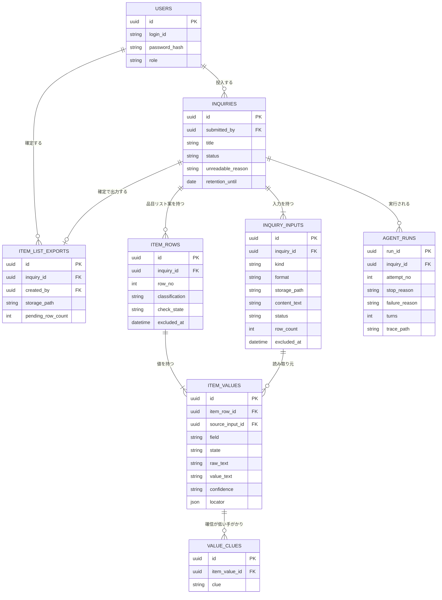

# DB設計書（詳細設計）: 引合書整理エージェント

> Vモデル: 詳細設計 / 対応する検証: 単体テスト
> 機能（②）・画面（③）・エージェント設計（`agent.md`）に必要なデータを、テーブル設計に落とし込む。

## 0. 前提（DBエンジンと保存方針）

`07-infra.md` は作らない（Sprint3 はインフラ設計なし・すべてローカル実行）。自前ホスティングを前提に、次の方針で設計する。

| 項目 | 決めたこと | 理由 |
|------|-----------|------|
| DBエンジン | **PostgreSQL**（Docker・Slice 0-2） | 計画のスタック。UUID・JSONB が使えるので、読み取り元の位置（形式ごとに構造が違う）を JSONB で持てる |
| 主キー | **UUID**（`gen_random_uuid()`） | 実行ID（run_id）をトレースのファイル名 `backend/traces/{run_id}.jsonl` と共有するため。連番だと推測でき、他案件の参照を試せてしまう |
| 状態値 | **text ＋ CHECK 制約**（PostgreSQL の ENUM 型は使わない） | 状態の追加（例: Scope 2 の営業担当ロール）でマイグレーションが単純になる |
| ファイルの実体 | **DB に持たない。** ローカルの保管ディレクトリに置き、DB はパスだけを持つ | 原本は最大20MB・1案件50MB。DB に入れるとバックアップと復元が重くなる |
| メール本文 | **DB にテキストとして持つ**（`inquiry_inputs.content_text`） | ファイルではなくテキストのため。原本ダウンロード（SCR-10）もこの列から作る |
| 認証 | 外部の認証サービスを使わないので **`password_hash` を持つ**（Slice 0-4 の JWT 認証） | ② FUNC-12・非機能（セキュリティ）。JWT はステートレスなのでセッションのテーブルは作らない |
| 保持期間 | `inquiries.retention_until` に期限を持つ。**自動削除は行わない** | ② 非機能（確定から90日／未確定は投入から90日）。自動削除の実装は FUNC-10 で Out of Scope のため、期限の記録だけを持ち、削除は手動運用 |

## 1. テーブル一覧

| テーブル名 | 目的 | 関連機能(②) |
|-----------|------|-------------|
| `users` | 利用者（Scope 1 は営業事務ロールのみ）。ログインと操作の記録に使う | FUNC-12 |
| `inquiries` | 引合の案件。5段階の状況・読み取り不可の理由・確定の記録を持つ | FUNC-01 / FUNC-03 / FUNC-06 / FUNC-07 |
| `inquiry_inputs` | 案件に投入された**入力**（ファイルとメール本文）。入力ごとの状態と除外を持つ | FUNC-01 / FUNC-02 / FUNC-06 / FUNC-07 |
| `item_rows` | 品目リスト案の行。行の分類・確認済みか・除外したかを持つ | FUNC-02 / FUNC-04 / FUNC-05 / FUNC-06 |
| `item_values` | 行の中の値（品目名・型番・数量・単位・納期・備考）。原文・正規化後の値・確信度・読み取り元を持つ | FUNC-02 / FUNC-04 / FUNC-05 |
| `value_clues` | 確信が低いと判断した手がかり（H1〜H4）。1つの値に複数付く | FUNC-02 / FUNC-04 |
| `agent_runs` | エージェントの実行記録。停止理由・ターン数・トレースの場所・再実行の回数 | FUNC-02 / FUNC-03 / FUNC-07 |
| `item_list_exports` | 確定時に出力した品目リスト（Excel）の記録。再ダウンロードに使う | FUNC-06 |

### エージェントのツールとの対応（`agent.md` Part 2）

ツール一覧の「必要なAPI/テーブル」が、このテーブル群で実現される。

| ツール | 読み書きするテーブル |
|--------|-------------------|
| `list_input_files` | `inquiries`（参照）・`inquiry_inputs`（参照） |
| `read_file_content` | `inquiry_inputs`（参照。実体は `storage_path` か `content_text`） |
| `save_item_rows` | `item_rows`・`item_values`・`value_clues`（案件の下書きを置き換え） |
| `verify_sources` | `item_values`（参照）・`inquiry_inputs`（参照）・照合した時刻を `item_values.verified_at` に記録 |
| `set_file_status` | `inquiry_inputs.status` / `unreadable_reason` / `read_range` |
| `check_completion` | `inquiries.status` / `unreadable_reason`・`agent_runs`（停止理由の記録） |

## 2. ER図

## 3. テーブル定義

### users

**目的**: 利用者。Scope 1 は営業事務ロールのみ（② 非機能・権限モデル）。

| カラム | 型 | 制約 | 説明 |
|-------|-----|------|------|
| id | uuid | PK, DEFAULT gen_random_uuid() | 主キー |
| login_id | text | NOT NULL, UNIQUE | ログインに使うユーザーID（SCR-01） |
| password_hash | text | NOT NULL | パスワードのハッシュ。平文は保存しない |
| display_name | text | NOT NULL | 画面に出す名前（例: 中村） |
| role | text | NOT NULL, CHECK (`sales_clerk`), DEFAULT `sales_clerk` | Scope 1 は営業事務のみ。Scope 2 で `sales`（営業担当）を追加する |
| is_active | boolean | NOT NULL, DEFAULT true | 無効化した利用者はログインできない |
| created_at | timestamptz | NOT NULL, DEFAULT now() | 作成日時 |
| updated_at | timestamptz | NOT NULL, DEFAULT now() | 更新日時 |

### inquiries

**目的**: 引合の案件。処理状況（③ SCR-02・SCR-04 の5段階）と確定の記録を持つ。

| カラム | 型 | 制約 | 説明 |
|-------|-----|------|------|
| id | uuid | PK, DEFAULT gen_random_uuid() | 主キー |
| title | text | NOT NULL | 件名。最初のファイル名（複数なら「ほか N 件」を画面側で付ける）。メール本文だけなら本文の1行目 |
| status | text | NOT NULL, CHECK (`received` / `reading` / `unreadable` / `awaiting_review` / `confirmed`) | 受付済み／読み取り中／読み取り不可／確認待ち／確定済み（② FUNC-03 の5段階） |
| unreadable_reason | text | NULL, CHECK (`illegible` / `no_items` / `timeout` / `max_turns`) | 判読不能／明細なし／タイムアウト／最大ターン数超過（② FUNC-07）。status が `unreadable` のときだけ入る |
| submitted_by | uuid | NOT NULL, FK → users.id | 投入した利用者 |
| submitted_at | timestamptz | NOT NULL, DEFAULT now() | 投入日時。KPI6（当日中の受け渡し率）の起点 |
| review_started_at | timestamptz | NULL | 確認画面が最初に表示された時刻。**KPI1（1件あたりの作業時間）の起点** |
| confirmed_by | uuid | NULL, FK → users.id | 確定した利用者 |
| confirmed_at | timestamptz | NULL | 確定日時。KPI1 の終点、保持期間の起点 |
| retention_until | date | NOT NULL | 保持期限。確定したら確定日＋90日、未確定なら投入日＋90日（② 非機能）。自動削除はしない |
| created_at | timestamptz | NOT NULL, DEFAULT now() | 作成日時 |
| updated_at | timestamptz | NOT NULL, DEFAULT now() | 更新日時 |

**主なインデックス**: `(status, submitted_at DESC)`（SCR-02 の状況タブと並び順）、`(retention_until)`（保持期限を過ぎた案件の洗い出し）

### inquiry_inputs

**目的**: 案件に投入された**入力**（ファイルとメール本文）。① の用語定義「入力」に対応し、入力ごとに状態を持つ。

| カラム | 型 | 制約 | 説明 |
|-------|-----|------|------|
| id | uuid | PK, DEFAULT gen_random_uuid() | 主キー |
| inquiry_id | uuid | NOT NULL, FK → inquiries.id, ON DELETE CASCADE | 所属する案件 |
| kind | text | NOT NULL, CHECK (`file` / `mail_body`) | ファイルか、メール本文か |
| display_name | text | NOT NULL | ファイル名、またはメール本文を表す名前 |
| format | text | NOT NULL, CHECK (`excel` / `pdf` / `word` / `mail_body`) | 何として読むかの判定結果（② FUNC-01） |
| byte_size | integer | NULL, CHECK (byte_size <= 20971520) | ファイルのサイズ。1ファイル 20MB まで（② FUNC-01） |
| storage_path | text | NULL | 原本の保管パス。kind が `file` のときだけ入る（実体は DB に持たない） |
| content_text | text | NULL | メール本文の全文。kind が `mail_body` のときだけ入る |
| status | text | NOT NULL, CHECK (`pending` / `read` / `read_no_items` / `unreadable`), DEFAULT `pending` | 未処理／読み取り済み／読み取り済み（明細なし）／読み取り不可（① 入力の状態） |
| unreadable_reason | text | NULL, CHECK (`illegible`) | 入力に付く理由は判読不能のみ。タイムアウトと最大ターン数超過は案件側（`inquiries`）に付く |
| read_range | text | NULL | どこまで読めたか（例「明細の5行目まで」）。SCR-10 の「読めた範囲」 |
| row_count | integer | NOT NULL, DEFAULT 0 | この入力から抽出した行数。SCR-05 の入力一覧に出す |
| excluded_at | timestamptz | NULL | 除外した時刻。読み取り不可の入力を「手作業で補う」と判断したとき（② FUNC-07） |
| excluded_by | uuid | NULL, FK → users.id | 除外した利用者 |
| created_at | timestamptz | NOT NULL, DEFAULT now() | 作成日時 |

**制約**: `CHECK ((kind = 'file' AND storage_path IS NOT NULL AND content_text IS NULL) OR (kind = 'mail_body' AND content_text IS NOT NULL AND storage_path IS NULL))`
**主なインデックス**: `(inquiry_id)`

### item_rows

**目的**: 品目リスト案の行。確認済みか・除外したかを持つ（③ SCR-05）。

| カラム | 型 | 制約 | 説明 |
|-------|-----|------|------|
| id | uuid | PK, DEFAULT gen_random_uuid() | 主キー |
| inquiry_id | uuid | NOT NULL, FK → inquiries.id, ON DELETE CASCADE | 所属する案件 |
| row_no | integer | NOT NULL | 表示順。案件の中で一意 |
| classification | text | NOT NULL, CHECK (`needs_confirmation` / `low_confidence` / `high_confidence`) | 行の分類。値の状態から決まる派生値を保存する（下の「正規化の検討」を参照）。**呼び方はこの表を正とする**（下記） |

**行の分類の呼び方**（③ の画面文言と ④⑤・コードの識別子の対応。**この表を正とし、03 と 05 はここを参照する**）

| 表示名（③ 画面） | 識別子（④・⑤・コード） | 行の意味 |
|-----------------|----------------------|---------|
| 要確認 | `needs_confirmation` | 要確認の値を1つ以上含む行 |
| 確信が低い | `low_confidence` | 要確認はないが、確信が低い値を含む行 |
| 確信が高い | `high_confidence` | すべての値の確信度が高い行 |

値の状態も同じ3語を使う（① の用語の定義そのまま）。行の分類はその行の値から決まる（⑤ #10）ので、語を分けない。CHECK 制約の値がそのままコードの識別子になる。
| source_opened_at | timestamptz | NULL | **その行の読み取り元を人が最初に開いた時刻**（#14 の GET）。一括確認の抜き取り判定に使う。2回目以降は更新しない |
| check_state | text | NOT NULL, CHECK (`unchecked` / `checked`), DEFAULT `unchecked` | 未確認／確認済み。**確定は未確認が0のときだけ**（② FUNC-06） |
| checked_at | timestamptz | NULL | 確認済みにした時刻 |
| checked_by | uuid | NULL, FK → users.id | 確認済みにした利用者 |
| excluded_at | timestamptz | NULL | 除外した時刻。除外した行は Excel に出力せず、未確認からも外れる（② FUNC-05） |
| excluded_by | uuid | NULL, FK → users.id | 除外した利用者 |
| created_at | timestamptz | NOT NULL, DEFAULT now() | 作成日時 |
| updated_at | timestamptz | NOT NULL, DEFAULT now() | 更新日時 |

**制約**: `UNIQUE (inquiry_id, row_no)`
**主なインデックス**: `(inquiry_id, row_no)`、`(inquiry_id, classification)`（一括確認の抜き取り判定）

**一括確認の判定に使う数え方**（② FUNC-04）: N = 確信が高く、除外していない行の数（**確認済みかどうかは問わない**）。抜き取り数 = そのうち `source_opened_at` が NOT NULL の行の数。抜き取り数 ≧ min(3, N) で一括確認を許可する。確認済みを N から除くと、1行ずつ確認するたびに分母が動いて判定が不安定になるため。

### item_values

**目的**: 行の中の値。**原文と正規化後の値の両方**を持ち、読み取り元と確信度を記録する（`agent.md` の完了条件③〜⑥）。

| カラム | 型 | 制約 | 説明 |
|-------|-----|------|------|
| id | uuid | PK, DEFAULT gen_random_uuid() | 主キー |
| item_row_id | uuid | NOT NULL, FK → item_rows.id, ON DELETE CASCADE | 所属する行 |
| field | text | NOT NULL, CHECK (`item_name` / `model_no` / `quantity` / `unit` / `due_date` / `note`) | 品目名・型番・数量・単位・納期・備考。備考だけが任意項目 |
| state | text | NOT NULL, CHECK (`extracted` / `needs_confirmation`) | 抽出した値か、「要確認」（引合書に記載がない）か |
| raw_text | text | NULL | **原文**（原本に書かれていたとおりの文字列）。読み取り元の照合はこの値で行う |
| value_text | text | NULL | 正規化した後の表示用の値 |
| quantity_value | numeric | NULL | 数量の数値。field が `quantity` で state が `extracted` のとき必須 |
| due_kind | text | NULL, CHECK (`fixed_date` / `month_range` / `needs_confirmation`) | 納期の値域 (a)(b)(c)（② FUNC-02）。field が `due_date` のとき必須 |
| due_start | date | NULL | (a) は当日、(b) は範囲の開始日 |
| due_end | date | NULL | (b) の範囲の終了日。(a) は `due_start` と同じ |
| confidence | text | NOT NULL, CHECK (`high` / `low`) | 確信が高い／低い |
| source_input_id | uuid | NULL, FK → inquiry_inputs.id | どの入力から読んだか。state が `extracted` のとき必須 |
| locator | jsonb | NULL | 入力の中の位置。Excel `{"sheet":"明細","cell":"C12"}` ／ PDF `{"page":2,"line":3}` ／ Word `{"table":2,"row":3,"col":2}` または `{"paragraph":12}` ／ メール本文 `{"line":14}` |
| verified_at | timestamptz | NULL | 読み取り元の照合が一致した時刻（`verify_sources`）。**機械の照合の記録であり、人が確認したことを表すものではない**（人の抜き取りは `item_rows.source_opened_at`） |
| edited_at | timestamptz | NULL | **人が直した時刻**（③ SCR-07 ／ ⑤ #10）。下の CHECK の対象外にするかどうかを、この列で決める |
| edited_by | uuid | NULL, FK → users.id | 直した利用者 |
| created_at | timestamptz | NOT NULL, DEFAULT now() | 作成日時 |
| updated_at | timestamptz | NOT NULL, DEFAULT now() | 更新日時 |

**制約**:
- `UNIQUE (item_row_id, field)` — 1行に同じ項目は1つ
- `CHECK (state = 'extracted' AND ((raw_text IS NOT NULL AND source_input_id IS NOT NULL AND locator IS NOT NULL) OR edited_at IS NOT NULL)) OR (state = 'needs_confirmation' AND raw_text IS NULL AND source_input_id IS NULL AND locator IS NULL)` — **要確認でない値には必ず読み取り元がある**（`agent.md` 完了条件④、ガードレール「推測で埋めない」をDBでも担保する）。
  **ただし `edited_at` が入っている値（人が SCR-07 で直した値）は対象外**。この制約は「エージェントが推測で値を埋める」のを止めるためのもので、人が自分の判断で入力した値はその対象ではない（人が入れた値には読み取り元が無い。マイグレーション `19175c7c1dd5` で緩和）
- 値を「要確認」に戻したときは、上の CHECK に合わせて **原文（`raw_text`）と読み取り元も外れる**（原文は失われる）
- `CHECK (due_kind IS NULL OR due_kind <> 'month_range' OR (due_start IS NOT NULL AND due_end IS NOT NULL AND due_start <= due_end))` — (b) は同じ月の中で開始日 ≦ 終了日（③ SCR-07）

**主なインデックス**: `(item_row_id)`、`(source_input_id)`

### value_clues

**目的**: 確信が低いと判断した手がかり（H1〜H4）。1つの値に複数付くので別テーブルにする（`agent.md`「すべて記録する」）。

| カラム | 型 | 制約 | 説明 |
|-------|-----|------|------|
| id | uuid | PK, DEFAULT gen_random_uuid() | 主キー |
| item_value_id | uuid | NOT NULL, FK → item_values.id, ON DELETE CASCADE | 対象の値 |
| clue | text | NOT NULL, CHECK (`H1` / `H2` / `H3` / `H4`) | H1 ファイル間不一致／H2 列内の形式ずれ／H3 単位数量の不自然／H4 正規化の非一意 |
| detail | text | NULL | 判断の根拠（例「仕様書.pdf では 400」）。SCR-06 に出す |
| created_at | timestamptz | NOT NULL, DEFAULT now() | 作成日時 |

**制約**: `UNIQUE (item_value_id, clue)`
**主なインデックス**: `(item_value_id)`

### agent_runs

**目的**: エージェントの実行記録（`agent.md` の出力形式）。トレースと1対1で対応する。

| カラム | 型 | 制約 | 説明 |
|-------|-----|------|------|
| run_id | uuid | PK, DEFAULT gen_random_uuid() | 実行ID。トレースのファイル名 `backend/traces/{run_id}.jsonl` と同じ |
| inquiry_id | uuid | NOT NULL, FK → inquiries.id, ON DELETE CASCADE | 対象の案件 |
| attempt_no | smallint | NOT NULL, CHECK (attempt_no IN (1, 2)) | 1 = 初回、2 = 再実行。**再実行は1回まで**（② FUNC-07）をDBでも担保する |
| model | text | NOT NULL | 使ったモデル（`claude-sonnet-5`） |
| max_turns | integer | NOT NULL | そのときの最大ターン数（既定 30） |
| status | text | NOT NULL, CHECK (`running` / `finished`), DEFAULT `running` | 実行中か、終わったか |
| stop_reason | text | NULL, CHECK (`completed` / `failed` / `max_turns` / `inner_timeout` / `inactivity_timeout` / `outer_timeout`) | 停止理由（`agent.md` の停止条件）。status が `finished` のとき必須 |
| failure_reason | text | NULL, CHECK (`illegible` / `no_items`) | `stop_reason` が `failed` のときの内訳（判読不能／明細なし） |
| turns | integer | NULL | 使ったターン数 |
| started_at | timestamptz | NOT NULL, DEFAULT now() | 開始時刻 |
| finished_at | timestamptz | NULL | 終了時刻。性能の受入基準（投入から確認待ちまで3分以内）の判定に使う |
| trace_path | text | NOT NULL | トレースの保存先 |
| created_at | timestamptz | NOT NULL, DEFAULT now() | 作成日時 |

**制約**: `UNIQUE (inquiry_id, attempt_no)`
**主なインデックス**: `(inquiry_id, started_at DESC)`

### item_list_exports

**目的**: 確定時に出力した品目リスト（Excel）の記録。SCR-09 の再ダウンロードに使う。

| カラム | 型 | 制約 | 説明 |
|-------|-----|------|------|
| id | uuid | PK, DEFAULT gen_random_uuid() | 主キー |
| inquiry_id | uuid | NOT NULL, UNIQUE, FK → inquiries.id, ON DELETE CASCADE | 対象の案件。確定は1案件につき1回なので1対1 |
| storage_path | text | NOT NULL | 出力した Excel の保管パス（実体は DB に持たない） |
| row_count | integer | NOT NULL | 出力した行数（除外した行は含まない） |
| pending_row_count | integer | NOT NULL, DEFAULT 0 | 「顧客回答待ち」として出力した行数（③ SCR-09 の表示） |
| created_by | uuid | NOT NULL, FK → users.id | 確定した利用者 |
| created_at | timestamptz | NOT NULL, DEFAULT now() | 確定・出力の日時 |

> 確定後の修正は Out of Scope（② Out of Scope）。**同じファイルを何度でもダウンロードできる**ようにするため、確定時に1回だけ生成して保管し、以後はこのレコードを参照する。

## 4. 正規化の検討

第3正規形を基本にしたうえで、2か所だけ例外を置く。

| 箇所 | 判断 | 理由 |
|------|------|------|
| `item_rows.classification` | **派生値を保存する**（非正規化） | 行の分類は値（`item_values`）から決まるが、SCR-05 は毎回この順で並べ替え、分類ごとの件数も出す。値を更新するたびに再計算して保存すれば、表示のたびに集計しなくて済む。整合性は「値を書き換えるのは `save_item_rows` と SCR-07 の保存だけ」という経路の限定で担保する |
| `item_list_exports` | **確定時点のスナップショットを別に持つ** | 出力した Excel は確定時の内容のまま再ダウンロードできる必要がある。品目行から毎回作り直すと、将来 Scope 2 以降で行を触れるようにしたときに中身が変わってしまう |

**保存しないもの**（画面表示のたびに集計する）

- 未確認の行数、分類ごとの件数（SCR-05 の「未確認 11 / 全 13 行」）
- 要確認の項目数（SCR-08）
- 案件ごとの読み取れなかった入力の数（SCR-02 の補足）

いずれも1案件あたり最大30行・入力10件なので、集計の負荷より整合性のずれのほうが害が大きい。

> 実際に動く CREATE 文（DDL）は Build フェーズの成果物として作成する（Slice 0-3 のマイグレーション）。
> この設計書ではテーブル定義表・ER図・制約までを正とする。

---

## 次のステップ

→ `05-api-ipo`（API・IPO一覧・詳細設計）でフローごとのIPOとAPI一覧を作成する
→ 必要に応じて `02-requirement`（要件定義書）の「対応テーブル」欄を追記更新する
